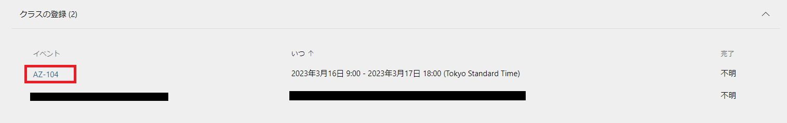
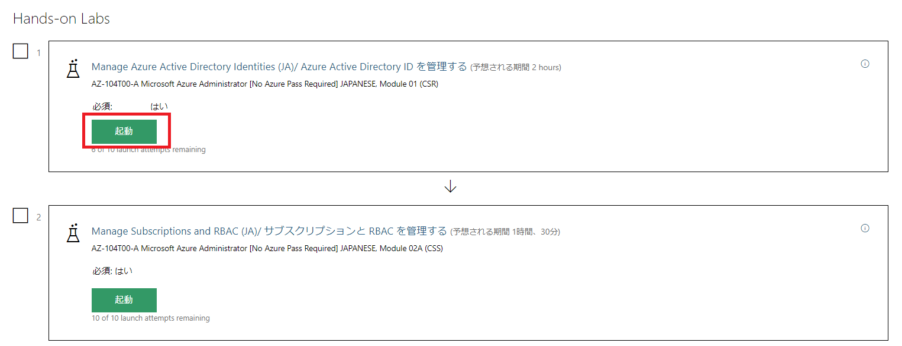
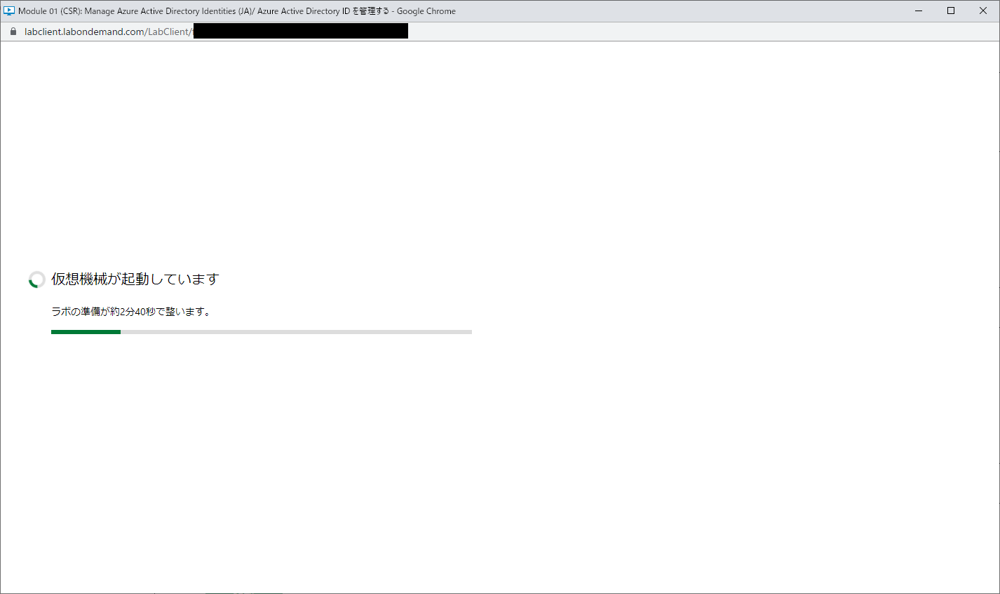
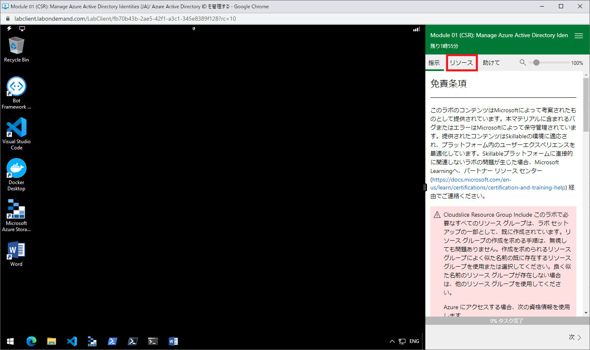
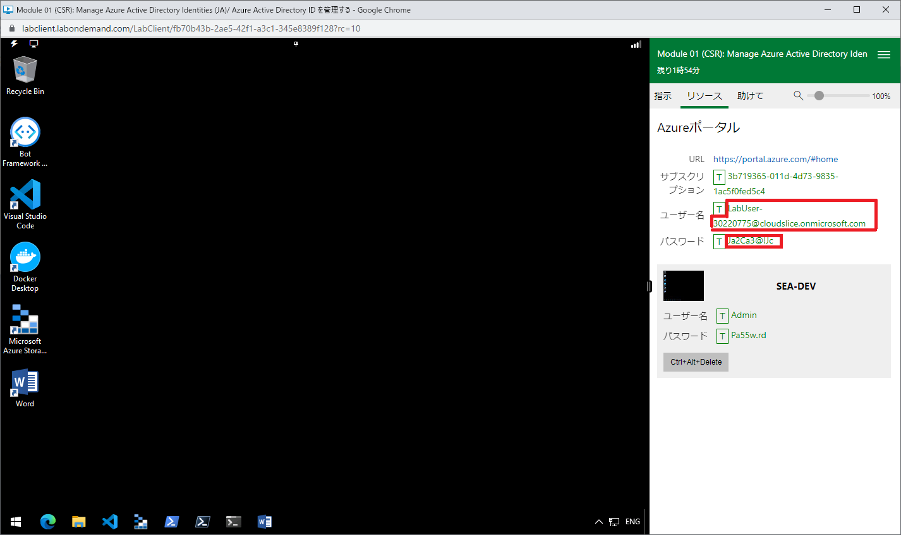

---
lab:
    title: '00 - 事前準備'
    module: 'モジュール 00 - はじめに'
---

# ラボ 00 - ラボ環境アクセス用アカウントの取得

# 受講生用ラボ マニュアル

## ラボ シナリオ

本作業は Azure 上で演習するために必要なアカウントを取得する作業となります。

各演習実施時に以下の手順を実施してください。

## 目標

このラボでは次の内容を準備します。

+ タスク 1: ハンズオンラボの起動
+ タスク 2: アカウントの確認
+ タスク 3: Azure Portalへのサインイン

## 予想時間: 10 分

## 手順

### 準備 1

#### タスク 1: ハンズオンラボの起動

このタスクでは、Skillableにサインインしてハンズオンラボを起動します。各モジュールの演習毎に実施する作業になります。

1. [Skillable](https://alh.learnondemand.net/) にアクセスし、ご自身の ID とパスワードで サインインします。 

2. サインイン後に表示される**クラスの登録**から、今回受講しているイベントを選択します。

    

    > **注**:上図のイベント名、開催期間については一例です。ご受講いただいているコースで登録したイベントを選択してください。

3. イベントに移動し、**Hands-on Labs**の中から実施したい演習の「**起動**」ボタンをクリックします。

    

4. 別ウィンドウが展開され、ラボ環境が起動するのを待ちます。

    

#### タスク 2: アカウントの確認

このタスクでは、前のタスクで起動したラボからアカウント情報を取得します。

1. タスク1で起動したラボ環境のウィンドウで、右側の手順ペインより**リソース**タブを選択します。

   

2. リソースタブに記載されている**ユーザー名**および**パスワード**をコピーアンドペーストして、メモ帳等に貼り付けます。

   

   > **注**:Tボタンやユーザー名などをクリックしてもクリップボード上にはコピーされません。手動でユーザー名およびパスワードを選択してコピーする
   > 　 必要があります。

3. アカウント情報の取得後はラボ環境のウィンドウを使用しないため、右上の×ボタンをクリックしてウィンドウを閉じます。

   > **注**:起動したラボ環境をそのまま使用することも可能です。この後の手順では、ローカル環境のブラウザを使用して演習を実施する方法を
   > 　 説明します。

#### タスク 3:  Azure Portalへのサインイン

このタスクでは、前タスクで取得したアカウント情報でAzure Portalにログインします。

1. [**Azure Portal**](https://portal.azure.com/)にアクセスします。

1. サインイン画面が表示されたら、「**メール、電話、Skype**」の欄に前タスクで取得した**ユーザー名**を入力して**次へ**をクリック、
    「**パスワード**」の欄に同じく取得した**パスワード**を入力してサインインします。

1. サインイン完了後、[**LabManual**](https://github.com/ctct-edu/az-104-labS/tree/main/LabManual)の各演習手順に従って演習を実施してください。
    なお、一部の演習ではサンプルデータを使用するため、[**こちらのリンク**](https://github.com/MicrosoftLearning/AZ-104-MicrosoftAzureAdministrator/archive/master.zip)をクリックして、サンプルデータをダウンロードしてください。

    

#### レビュー

このラボでは次の内容を準備しました。

- タスク 1: ハンズオンラボ環境の起動
- タスク 2: アカウントの確認
- タスク 3: Azure Portalへのサインイン
