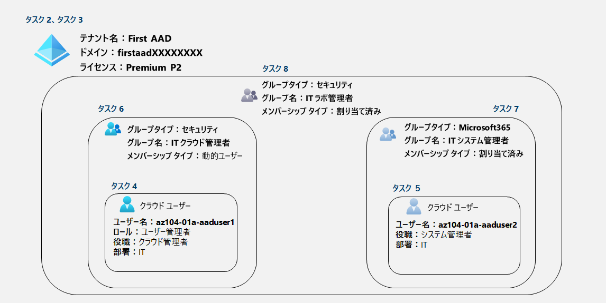

---
lab:
    title: '01 - Azure Active Directory ID を管理する'
    module: 'モジュール 01 - ID'
---

# ラボ 01 - Azure Active Directory ID を管理する

## ラボ シナリオ

このラボでは、Azure Active Directoryを使用してアカウント管理を実施します。

## 目標

このラボでは次の内容を学習します。

+ タスク １：Azure Portalへサインイン

+ タスク ２：新たなテナントを作成

+ タスク ３：Premium ライセンスを有効化

+ タスク ４：ユーザー作成とロール付与

+ タスク ５：ユーザー作成とライセンス付与

+ タスク ６：セキュリティグループ（動的ユーザー）の作成

+ タスク ７：Microsoft365グループ（割り当て済み）の作成（オプション）

+ タスク ８：セキュリティグループ（割り当て済み）の作成 （オプション）

  **※（オプション）は時間がある場合に実施してください。**

## 予想時間: 40 分

## アーキテクチャの図

## 手順

#### タスク 1：Azure Portalへサインイン

1. [Azure portal](https://portal.azure.com) に**Skillable**のラボ環境から取得したアカウントでサインインします。

   > 注：ラボ環境へのアクセスは以下の手順を確認してください。
   >
   > 　　[ラボ 00 - ラボ環境アクセス用アカウントの取得](https://github.com/ctct-edu/az-104-labS/blob/main/LabManual/LAB_00-Startup_Hands-on_Lab.md)

#### タスク ２：新たなテナントを作成

> **シナリオ：このタスクでは、新たに「First AAD」テナントを作成します。**

1. Azure portal の画面上部にある検索ボックス「**Azure Active Directory**」 と入力します。

   > 注：サインイン後、「**ツアーへようこそ**」と表示された場合は「**後で行う**」をクリックします。

1. 一覧に「Azure Active Directory」と表示されます。検索結果をクリックします。

1. 「**cloudslice | 概要**」 ブレードの画面中央にある[**テナントの管理**]をクリックします。

1. 「**テナントの管理**」 ブレードの 「**+作成**」 をクリックします。

1. 「**テナントの作成**」 ブレードの 「**基本**」タブは以下を選択し「**次：構成**」 をクリックします。

   | 設定                     | 値                         |
   | ------------------------ | -------------------------- |
   | テナントの種類を選択する | **Azure Active Directory** |

1. 「**テナントの作成**」 ブレードの 「**構成**」タブは以下を値を入力し「**次：確認および作成**」 をクリックします。

   | 設定           | 値                                                           |
   | -------------- | ------------------------------------------------------------ |
   | 組織名         | **First AAD**                                                |
   | 初期ドメイン名 | **firstaadXXXXXXXX** ※XにはLabUser-XXXXXXXXと同じ8桁の数字を入力します。(あるいはランダムで一意な数字) |
   | 場所           | **米国** (またはUnited States)                               |

1. 「**テナントの作成**」 ブレードの 「**確認および作成**」タブで入力に誤りがないか確認し「**作成**」 をクリックします。

1. 画面右より「**あなたがロボットではないことを確認させてください。**」と表示されます。

   画面に表示されているCAPTCHAを解き、「**送信**」をクリックします。

1. 「**テナントが正常に作成されました。新しいテナントに移動するには、ここをクリックします。**」と表示されます。

   作成したテナント名「**Frist AAD**」のリンクをクリックします。

1. ブレードが表示されます。画面右上のユーザーアイコン部分も「**FIRST AAD**」に変わったことを確認します。

#### タスク ３：Premium ライセンスを有効化

> **シナリオ：このタスクでは、First AADテナントに無料版の「Premium P2 ライセンス」を有効化します。**

1. 「**First AAD | 概要**」 ブレードの左側ツリーから「**ライセンス**」をクリックします。

1. 「**ライセンス | 概要**」ブレードの右側にあるクイックタスクから「**無料試用版を入手する**」をクリックします。

1. 画面右側に「**アクティブ化**」が表示されます。

   「**AZURE AD PREMIUM P2**」項目の「**無料試用版**」を展開し、「**アクティブ化**」をクリックします。

1. 画面上部の通知アイコン より「**Azure AD Premium P2 試用版が正常にアクティブ化されました**」と表示されるのを待ちます。

   > 注：画面右上にあるベルのマークを「通知アイコン」と言い、Azure上の操作、変更履歴、エラーなどの通知をします。
   >

1. 通知が表示された後、左ツリーにある「すべての製品」をクリックします。

1. 「**ライセンス | すべての製品**」 ブレード内の一覧に「**Azure Active Directory Premium P2**」が表示されたことを確認します。

   > 注：ライセンスの反映から表示されるまで時間がかかる場合があります。
   >
   > 　　Webブラウザを何度か再読み込みする必要があります。
   >
   > 注：表示に時間を要する場合があります。**2分ほど待っても変わらない場合はタスク4**に進んでください。

1. Azure portal の画面上部にある検索ボックス「**Azure Active Directory**」 と入力します。

1. 一覧に「**Azure Active Directory**」と表示されます。検索結果をクリックします。

1. 「**First AAD | 概要**」ブレードが表示されます。

1. 画面中央にあるライセンスが「**Azure AD Premium P2**」と表示されたことを確認します。

   > 注：ライセンスの反映から表示されるまで時間がかかる場合があります。
   >
   > 　　Webブラウザを何度か再読み込みする必要があります。
   >
   > 注：表示に時間を要する場合があります。**2分ほど待っても変わらない場合はタスク4**に進んでください。

#### タスク ４：ユーザー作成とロール付与

> **シナリオ：このタスクでは、First AADテナントに「az104-01a-aaduser1」という新たなユーザーを作成します。**
>
> 　　　　　**さらに作成したユーザーに「ユーザー管理者」ロールを付与し、特権アカウントにします。**

1. 「**First AAD | 概要**」 ブレードの左側ツリーから「**ユーザー**」をクリックします。

1. 「**ユーザー**」 ブレードにある「**＋新しいユーザー**」をクリックし、さらに「**新しいユーザーの作成**」をクリックします。

1. 「**新しいユーザー**」 ブレードで以下の項目を入力し、画面下部にある「**作成**」をクリックします。

   > 表に無い項目は[デフォルトの値]または[未入力]となります。

   | 設定           | 値                             |
   | -------------- | ------------------------------ |
   | ユーザー名     | **az104-01a-aaduser1**         |
   | 名前           | **az104-01a-aaduser1**         |
   | パスワード     | **自分でパスワードを作成する** |
   | 初期パスワード | **Pa55w.rd123**                |
   | 利用場所       | **United States (または米国)** |
   | 役職           | **クラウド管理者**             |
   | 部署           | **IT**                         |

1. 「**ユーザー**」 ブレードに遷移します。画面内の「更新」またはWebブラウザの再読み込みを行います。

1. 「**ユーザー**」 ブレードの一覧に作成したユーザー「**az104-01a-aaduser1**」をクリックします。

1. 「**az104-01a-aaduser1**」 ブレードの一覧にある「**ユーザー プリンシパル名**」をコピーしてメモ帳などに保存します。

   > 注：ユーザー プリンシパル名は"ユーザー名"と"テナント名(ドメイン名)"で構成されるIDです。

1. 「**az104-01a-aaduser1**」 ブレードの左ツリーにある「**割り当てられたロール**」をクリックします。

1. 「**az104-01a-aaduser1 | 割り当てられたロール**」 ブレードにある「**＋割り当ての追加**」をクリックします。

1. 画面右に表示される「**ディレクトリ ロール**」より「**ユーザー管理者**」を選択し、「**追加**」をクリックします。

1. 「**az104-01a-aaduser1 | 割り当てられたロール**」ブレードに遷移します。画面内の更新またはWebブラウザの再読み込みを行います。

1. 一覧に「**ユーザー管理者**」と表示されたことを確認します。

1. Azure portal の画面上部にある検索ボックス「**Azure Active Directory**」 と入力します。

1. 一覧に「**Azure Active Directory**」と表示されます。検索結果をクリックします。

1. 「**First AAD | 概要**」ブレードが表示されます。

#### タスク ５：ユーザー作成とライセンス付与

>**シナリオ：このタスクでは、「ユーザー管理者」ロールを持つ「az104-01a-aaduser1」でサインインをします。**
>
>　　　　　**サインイン後、新たに「az104-01a-aaduser2」を作成します。**

1. Webブラウザを「**InPrivate**」または「**シークレット**」モードで用意します。

     > 注：演習の中ではWebブラウザの機能を使って別セッションでサインインします。
     >
     > 　　どのWebブラウザもウィンドウ右上の設定ボタンから表示することが可能です。
     >
     > 　  　-Microsoft Edgeでは「InPrivate」ウィンドウ
     >
     > 　  　-Google Chromeでは「シークレット」ウィンドウ
     >
     > 　  　-Mozilla Fire Foxでは「プライベート」ウィンドウ

1. 用意したWebブラウザおよび作成したアカウント(`az104-01a-aaduser1@firstaadXXXXXXXX.onmicrosoft.com`)で [Azure portal](https://portal.azure.com) にログインします。

1. 一覧に「**Azure Active Directory**」と表示されます。検索結果をクリックします。

1. 「**First AAD | 概要**」 ブレードの左側ツリーから「**ユーザー**」をクリックします。

1. 「**ユーザー**」 ブレードにある「**＋新しいユーザー**」をクリックし、さらに「**新しいユーザーの作成**」をクリックします。

1. 「**新しいユーザー**」 ブレードで以下の項目を入力し、画面下部にある「**作成**」をクリックします。

      > 表に無い項目は[デフォルトの値]または[未入力]となります。

      | 設定           | 値                             |
      | -------------- | ------------------------------ |
      | ユーザー名     | **az104-01a-aaduser2**         |
      | 名前           | **az104-01a-aaduser2**         |
      | パスワード     | **自分でパスワードを作成する** |
      | 初期パスワード | **Pa55w.rd123**                |
      | 利用場所       | **United States (または米国)** |
      | 役職           | **システム管理者**             |
      | 部署           | **IT**                         |

1. 「**ユーザー**」 ブレードに遷移します。画面内の「更新」またはWebブラウザの再読み込みを行います。

1. 「**ユーザー**」 ブレードの一覧に作成したユーザー「**az104-01a-aaduser2**」をクリックします。

1. 「**az104-01a-aaduser2**」 ブレードの左ツリーにある「**ライセンス**」をクリックします。

1. 「**az104-01a-aaduser2 | ライセンス**」 ブレードにある[**+割り当て**]をクリックします。

1. 「**ライセンス割り当ての更新**」 ブレードで 「**Azure Active Directory Premium P2**」 のチェックを入れ、「**保存**」をクリックします。

1. 「**az104-01a-aaduser2 | ライセンス**」 ブレードの一覧に割り当てたライセンスが表示されたことを確認します。

      >注：ライセンスの反映から表示されるまで時間がかかる場合があります。
      >
      >　　Webブラウザを何度か再読み込みする必要があります。

1. 画面右上のユーザー名をクリックし、「**サインアウト**」を行います。

1. 「**InPrivate**」または「**シークレット**」モードのWebブラウザを閉じます。

   

#### タスク ６：セキュリティグループ（動的ユーザー）の作成

>**シナリオ：このタスクではセキュリティグループ(動的ユーザー)を作成します。**

> 注：ここからは「LabUser-XXXXXXXX」のユーザー、Webブラウザに戻り操作を行います。

1. 「**First AAD | 概要**」 ブレードの左側ツリーから「**グループ**」をクリックします。

1. 「**グループ | すべてのグループ**」ブレードにある「**新しいグループ**」をクリックします。

1. 「**新しいグループ**」 ブレードで以下の項目を入力します。

   > 注：表に無い項目は[デフォルトの値]または[未入力]となります。
   >
   > 注：メンバーシップの種類を「**動的ユーザー**」に指定する場合、**Premium P1/P2**のライセンスが必要となります。
   >
   > 　　ライセンスがない場合、グレーアウトされ「割り当て済み」の選択となります。

   | 設定                                               | 値                                                          |
   | -------------------------------------------------- | ----------------------------------------------------------- |
   | グループの種類                                     | **セキュリティ**                                            |
   | グループ名                                         | **IT クラウド管理者**                                       |
   | グループの説明                                     | **Contoso IT クラウド管理者**                               |
   | グループに Azure AD ロールを割り当てることができる | **いいえ**                                                  |
   | メンバーシップの種類                               | **動的ユーザー**                                            |
   | 所有者                                             | **所有者が選択されていません** ※所有者は指定しません。 |

1. 「**動的クエリの追加**」をクリックし、以下の項目でルールの構成を設定します。

   | 設定        | 値                      |
   | ----------- | ----------------------- |
   | および/また | **空欄**（グレーアウト) |
   | プロパティ  | **job Title**           |
   | 演算子      | **Equals**              |
   | 値          | **クラウド管理者**      |

1. 「**ルールの検証**」タブをクリックし、画面内にある「**+ユーザーの追加**」をクリックします。

1. 画面右側に表示された「**ユーザーを追加**」で以下のユーザーを選び、「**選択**」をクリックします。

   | 設定             | 値                                                 |
   | ---------------- | -------------------------------------------------- |
   | 選択するユーザー | **az104-01a-aaduser1** **az104-01a-aaduser2** |

1. 「**動的メンバーシップ ルール**」ブレードの画面中央にある「状態」を確認します。

   > 注：ここではadduser1は✔、adduser2は✖になります。adduser1のjob Title(役職)はクラウド管理者のためです。

1. 「**動的メンバーシップ ルール**」ブレードの左上にある「保存」をクリックします。

1. 「**新しいグループ**」ブレードで「**作成**」をクリックします。

1. 「**グループ | すべてのグループ**」ブレードに遷移し、一覧に作成したグループ「**IT クラウド管理者**」が表示されたことを確認します。

   > 注：表示されない場合、画面内の「更新」またはWebブラウザの再読み込みを行います。

#### タスク ７：Microsoft365グループ（割り当て済み）の作成（オプション）

>**シナリオ：このタスクではMicrosoft365 グループ(割り当て済み)を作成します。**
>
>　　　　　**※この演習はオプション演習です。時間がある場合に実施してください。**

1. 「**グループ | すべてのグループ**」ブレードにある「**新しいグループ**」をクリックします。

1. 「**新しいグループ**」 ブレードで以下の項目を入力し「**作成**」をクリックします。

   > 注：表に無い項目は[デフォルトの値]または[未入力]となります。

   | 設定                                               | 値                                                          |
   | -------------------------------------------------- | ----------------------------------------------------------- |
   | グループの種類                                     | **Microsoft 365**                                           |
   | グループ名                                         | **IT システム管理者**                                       |
   | グループのメールアドレス                           | **IT_Sytem_Admin**                                          |
   | グループの説明                                     | **Contoso IT システム管理者**                               |
   | グループに Azure AD ロールを割り当てることができる | **いいえ**                                                  |
   | メンバーシップの種類                               | **割り当て済み**                                            |
   | 所有者                                             | **所有者が選択されていません** ※所有者は指定しません。 |
   | メンバー                                           | **az104-01a-aaduser2**                                      |

1. 「**グループ | すべてのグループ**」ブレードに遷移し、一覧に作成したグループ「**IT クラウド管理者**」が表示されたことを確認します。

   > 注：表示されない場合、画面内の「更新」またはWebブラウザの再読み込みを行います。

#### タスク ８：セキュリティグループ(割り当て済み)の作成（オプション）

>**シナリオ：このタスクではセキュリティ グループ(割り当て済み)を作成します。**
>
>　　　　　**※この演習はオプション演習です。時間がある場合に実施してください。**

1. 「**グループ | すべてのグループ**」ブレードにある「**新しいグループ**」をクリックします。

1. 「**新しいグループ**」 ブレードで以下の項目を入力し「**作成**」をクリックします。

   > 注：表に無い項目は[デフォルトの値]または[未入力]となります。

   | 設定                                               | 値                                                          |
   | -------------------------------------------------- | ----------------------------------------------------------- |
   | グループの種類                                     | **セキュリティ**                                            |
   | グループ名                                         | **IT ラボ管理者**                                           |
   | グループの説明                                     | **Contoso ITラボ管理者**                                    |
   | グループに Azure AD ロールを割り当てることができる | **いいえ**                                                  |
   | メンバーシップの種類                               | **割り当て済み**                                            |
   | 所有者                                             | **所有者が選択されていません** ※所有者は指定しません。 |
   | メンバー                                           | ・**IT クラウド管理者** ・**IT システム管理者**        |

1. 「**グループ | すべてのグループ**」ブレードに遷移し、一覧に作成したグループ「**IT ラボ管理者**」が表示されたことを確認します。

   > 注：表示されない場合、画面内の「更新」またはWebブラウザの再読み込みを行います。

#### レビュー

このラボでは次の内容を学習しました。

- タスク １：Azure Portalへサインイン
- タスク ２：新たなテナントを作成
- タスク ３：Premium ライセンスを有効化
- タスク ４：ユーザー作成とロール付与
- タスク ５：ユーザー作成とライセンス付与
- タスク ６：セキュリティグループ（動的ユーザー）の作成
- タスク ７：Microsoft365グループ（割り当て済み）の作成（オプション）
- タスク ８：セキュリティグループ（割り当て済み）の作成 （オプション）

