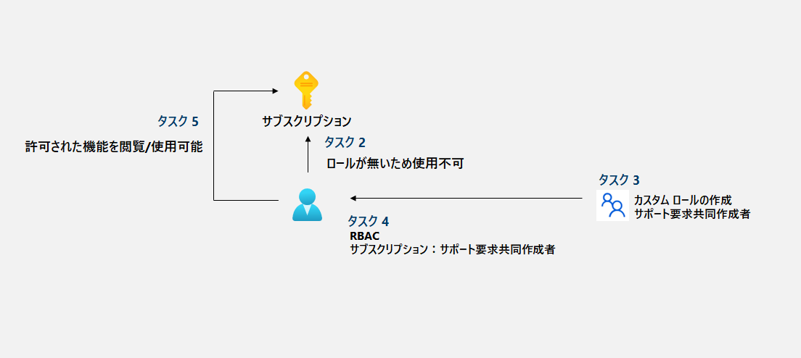

---
lab:
    title: '02a - サブスクリプションと RBAC を管理する'
    module: 'モジュール 02 - ガバナンスとコンプライアンス'
---

# ラボ 02a - サブスクリプションと RBAC を管理する
## ラボ シナリオ

このラボのタスクは以下の通りです。

+ タスク １：Azure Portalへサインイン
+ タスク ２：RBACロールが付与されていない状態を確認する
+ タスク ３：カスタム RBAC ロールを作成する
+ タスク ４：RBAC ロールを割り当てる
+ タスク ５：RBAC ロールの割り当てを確認する


## 推定時間: 30 分


## アーキテクチャ




## 手順

#### タスク 1：Azure Portalへサインイン

1. [Azure portal](https://portal.azure.com) に**Skillable**のラボ環境から取得したアカウントでサインインします。

   > 注：ラボ環境へのアクセスは以下の手順を確認してください。
   >
   > 　　[ラボ 00 - ラボ環境アクセス用アカウントの取得](https://github.com/ctct-edu/az-104-labS/blob/main/LabManual/LAB_00-Startup_Hands-on_Lab.md)
   >
   > 注：このラボでは2つのアカウントを使用します。それぞれのIDとパスワードを控えてください。
   >
   > 　　◇`LabUser-XXXXXXXX@LODSPRODMSLEARNMCA.onmicrosoft.com`
   >
   > 　　◇`az104-02-aaduser-XXXXXXXX@LODSPRODMSLEARNMCA.onmicrosoft.com`


#### タスク ２：RBACロールが付与されていない状態を確認

>**シナリオ：このタスクでは、予め用意されているユーザーでサインインし、ロールが割り当てられていない状態を確認します。**

1. Webブラウザを「**InPrivate**」または「**シークレット**」モードで用意します。

   > 注：演習の中ではWebブラウザの機能を使って別セッションでサインインします。
   >
   > 　　どのWebブラウザもウィンドウ右上の設定ボタンから表示することが可能です。
   >
   > 　  　-Microsoft Edgeでは「InPrivate」ウィンドウ
   >
   > 　  　-Google Chromeでは「シークレット」ウィンドウ
   >
   > 　  　-Mozilla Fire Foxでは「プライベート」ウィンドウ

1. 用意したWebブラウザで作成したアカウント(`az104-02-aaduser-XXXXXXXX@LODSPRODMSLEARNMCA.onmicrosoft.com`)で [Azure portal](https://portal.azure.com) にログインします。

1. 一覧に「**Azure へようこそ! サブスクリプションをお持ちでない場合は、次のオプションをご確認ください。**」表示されます。

   > 注：これは利用できるサブスクリプションが無いことを示します。

1. Azure portal の画面上部にある検索ボックスに「**ヘルプとサポート**」 と入力します。

1. 一覧に「**ヘルプとサポート**」と表示されます。検索結果をクリックします。

1. 「**ヘルプとサポート**」 ブレードの「**サポートリクエストの作成**」をクリックします。

1. 「**新しいサポートリクエスト**」ブレードの「**問題の種類**」で「**サブスクリプションの管理**」と「**課金**」のみ選べることを確認します。

   > サブスクリプションの権限があれば、対象のサブスクリプションを指定して問題を問い合わせすることが出来ます。

1. 画面左上の「Microsoft Azure」ロゴをクリックしてホーム画面に戻ります。

   > Webブラウザの通知で「保存されていない編集は破棄されます。」と表示された場合は「OK」または「はい」をクリックします。

1. 再び「Azureへようこそ！」が表示されます。一度Webブラウザを最小化します。


#### タスク ３：カスタム RBAC ロールを作成する

>**シナリオ：このタスクではカスタムRBACロールを作成します。**

> 注：ここからは「LabUser-XXXXXXXX」のユーザー、通常のWebブラウザに戻り操作を行います。

1. Azure portal の画面上部にある検索ボックスに「**サブスクリプション**」 と入力します。

1. 一覧に「**サブスクリプション**」と表示されます。検索結果をクリックします。

1. 「**サブスクリプション**」 ブレードにある「**MOC Subscription--xxxxxxxx**」をクリックします。

   > 注：サブスクリプション名が異なる場合がありますが、1つだけ表示されていれば、どれを選んでもOKです。

1. 「**MOC Subscription**」ブレードにある「**アクセス制御（IAM）**」をクリックします。

1. 「**MOC Subscription | アクセス制御 (IAM)**」ブレードにある「**＋追加**」をクリックし、さらに「**カスタム ロールの追加**」をクリックします。

1. 「**カスタムロールを作成する**」ブレードにある「**基本**」タブで以下を入力し、「**次へ**」をクリックします。

   | 設定                       | 値                                                           |
   | -------------------------- | ------------------------------------------------------------ |
   | カスタムロール名           | **サポート要求共同作成者 (カスタム)**                        |
   | 説明                       | **リソースグループの閲覧とサポートへのリクエストが出来るロール** |
   | ベースラインのアクセス許可 | **最初から始める**                                           |
      > 注：カスタムロール名が「重複している」という旨のメッセージが出る場合があります。その際は**サポート要求共同作成者 (カスタム) (1)**  などの括弧で番号などをご入力ください。

1. 「**カスタムロールを作成する**」ブレードにある「**アクセス許可**」タブにある「**+アクセス許可の追加**」をクリックします。

1. 「**アクセス許可の追加**」ブレードで「**アクセス許可を検索してください**」の箇所に以下をコピーして入力します。

   ```
   Microsoft.Resources/subscriptions/resourceGroups/read
   ```

1. 検索結果にでた「**Microsoft Resources**」をクリックします。

1. 画面内には「Microsoft.Resources/subscriptions/resourceGroups」のみが表示されます。✔を入れて「**追加**」をクリックします。

   > 注：このアクセス許可は「リソースグループのみの閲覧」を示しています。

1. もう一度「**カスタムロールを作成する**」ブレードにある「**アクセス許可**」タブ「**+アクセス許可の追加**」をクリックします。

1. 「**アクセス許可の追加**」ブレードで「**アクセス許可を検索してください**」の箇所に以下をコピーして入力します。

   ```
   Microsoft.Support
   ```

1. 検索結果にでた「**Microsoft Support**」をクリックします。

1. すべてに✔を入れて「**追加**」をクリックします。

   > 注：このアクセス許可は「サポートへの問い合わせ」を全て許可することを指しています。

1. 「**カスタムロールを作成する**」ブレードにある「**アクセス許可**」タブの「**次へ**」をクリックします。

1. 「**カスタムロールを作成する**」ブレードにある「**割り当て可能なスコープ**」タブでは変更はないため、「**次へ**」をクリックします。

1. 「**カスタムロールを作成する**」ブレードにある「**JSON**」タブでは変更はないため、「**次へ**」をクリックします。

1. 「**カスタムロールを作成する**」ブレードにある「**確認と作成**」タブで「**作成**」をクリックします。

1. 画面内に「**カスタム ロール "サポート要求共同作成者(カスタム)”が正常に作成～**」と表示されるため、「**OK**」をクリックします。


#### タスク ４：RBAC ロールを割り当てる

> シナリオ：このタスクでは、作成した「サポート共同作成者（カスタム）」ロールの割り当てを行います。

1. 「**MOC Subscription | アクセス制御 (IAM)**」ブレードにある「**＋追加**」をクリックし、さらに「**ロールの割り当ての追加**」をクリックします。

1. 「**ロールの割り当ての追加**」ブレードにある検索で「**サポート要求共同作成者 (カスタム)**」と入力します。

1. 検索結果の「**サポート要求共同作成者 (カスタム)**」をクリックし、さらに「**次へ**」をクリックします。

1. 「**ロールの割り当ての追加**」ブレードにある「**メンバー**」タブで「**＋メンバーの追加**」をクリックします。

1. 「**メンバーを選択する**」で検索に「**az104-02-aaduser-XXXXXXXX**」入力し、結果をクリックし、さらに「**選択**」をクリックします。

   > 注：誤ったユーザーを指定していないか、よく確認してください。

1. 「**ロールの割り当ての追加**」ブレードにある「**メンバー**」タブで「**次へ**」をクリックします。

1. 「**ロールの割り当ての追加**」ブレードにある「**レビューと割り当て**」タブで「**レビューと割り当て**」をクリックします。

1. 「**MOC Subscription | アクセス制御 (IAM)**」ブレードにある「**ロールの割り当て**」タブをクリックします。

1. 一覧ある「**サポート要求共同作成者 (カスタム)**」に指定したユーザーが設定されたことを確認します。

   > 注：表示されない場合、画面内の「更新」またはWebブラウザの再読み込みを行います。


#### タスク ５：RBAC ロールの割り当てを確認する

>**シナリオ：このタスクでは、予め用意されているユーザーでサインインし、ロールが割り当てられたことを確認します。**

1. タスク２で使用した「**InPrivate**」または「**シークレット**」モードのWebブラウザを用意します。

   >注：az104-02-aaduser-XXXXXXXXで使用したWebブラウザです。

1. 一度、Webブラウザを再読み込みします。

1. 「**Azure へようこそ! **」が**消え**、「**Azure サービス**」と表示されます。

   > 注：サブスクリプションの権限が与えられたことを示します。
   >
   > 　　まだ画面に「Azureへようこそ！」が消えない場合、複数回の画面読み込みを行ってください。
   >
   > 　　またはサインアウト/サインインをすると表示が変わる場合もあります。
   >
   > 　　それでも表示されない場合はロールの設定が正しいか確認してください。
   >

1. Azure portal の画面上部にある検索ボックスに「**リソースグループ**」 と入力します。

1. 一覧に「**リソースグループ**」と表示されます。検索結果をクリックします。

1. 「**リソースグループ**」 ブレードに「**ResourceGroup1**」と表示されたことを確認してください。

1. 「**リソースグループ**」 ブレードにある「**+作成**」をクリックします。

1. 「**リソース グループを作成します**」画面にある「リソースグループ」の項目に「**ABC-Resource**」と入力します。

1. エラーメッセージで「**リソース グループをサブスクリプション～アクセス許可がありません。**」と表示されたことを確認してください。

   > 注：このエラーは正しい動作です。既存のリソースグループの「**表示**」は出来ますが「**作成**」は権限に含まれていません。
   >
   > 　　Microsoft.Resources/subscriptions/resourceGroups/read

1. Azure portal の画面上部にある検索ボックスに「**ヘルプとサポート**」 と入力します。

1. 一覧に「**ヘルプとサポート**」と表示されます。検索結果をクリックします。

   > 注：Webブラウザの通知で「保存されていない編集は破棄されます。」と表示された場合は「OK」または「はい」をクリックします。

1. 「**ヘルプとサポート**」 ブレードの「**サポートリクエストの作成**」をクリックします。

1. 「**新しいサポートリクエスト**」ブレードの「**問題の種類**」では**タスク２**と違った項目が表示されます。

1. 「**新しいサポートリクエスト**」ブレードの「**問題の種類**」で**「技術（各種サービスについて）」**をクリックします。

1. 「**サブスクリプション**」の項目でサブスクリプションが表示されたことを確認します。

    >注：ロールの指定ではサブスクリプションのIAMに「**Microsoft Support**」を指定したため、表示や利用が行えます。
    >
    >注：このラボはこれで終了です。「**InPrivate**」または「**シークレット**」モードのWebブラウザを閉じてください。


#### レビュー

このラボでは次の内容を学習しました。

- タスク １：Azure Portalへサインイン
- タスク ２：RBACロールが付与されていない状態を確認する
- タスク ３：カスタム RBAC ロールを作成する
- タスク ４：RBAC ロールを割り当てる
- タスク ５：RBAC ロールの割り当てを確認する
