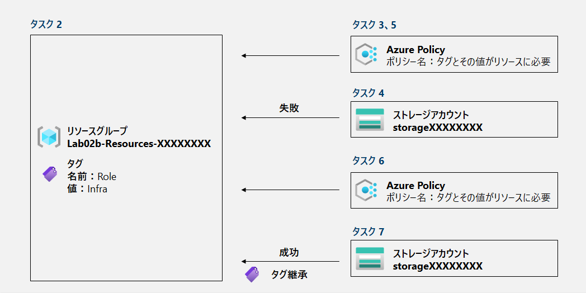

---
lab:
    title: '02b - Azure Policy を介してガバナンスを管理する'
    module: 'モジュール 02 - ガバナンスとコンプライアンス'
---

# ラボ 02b - Azure Policy を介してガバナンスを管理する
## ラボ シナリオ

このラボのタスクは以下の通りです。

+ タスク 1：Azure Portalへサインイン
+ タスク 2：リソースグループを作成する
+ タスク 3：Azure Policy を使用してタグ付けを強制する
+ タスク４：ポリシー「タグとその値がリソースに必要」を確認する
+ タスク５：設定した「タグとその値がリソースに必要」ポリシーを削除する
+ タスク６：Azure Policy を使用してタグ付けを適用する
+ タスク７：ポリシー「存在しない場合は、リソース グループからタグを継承する」を確認する

## 推定時間: 30 分

## アーキテクチャ

## 手順

#### タスク 1：Azure Portalへサインイン

1. [Azure portal](https://portal.azure.com) に**Skillable**のラボ環境から取得したアカウントでサインインします。

   > 注：ラボ環境へのアクセスは以下の手順を確認してください。
   >
   > 　　[ラボ 00 - ラボ環境アクセス用アカウントの取得](https://github.com/ctct-edu/az-104-labS/blob/main/LabManual/LAB_00-Startup_Hands-on_Lab.md)
   >

#### タスク 2：リソースグループを作成する

> **シナリオ：このタスクでは、リソースグループを作成します。**

1. Azure portal の画面上部にある検索ボックスに「**リソースグループ**」 と入力します。

1. 一覧に「**リソースグループ**」と表示されます。検索結果をクリックします。

1. 「**リソースグループ**」 ブレードにある「**+作成**」をクリックします。

1. 「**リソース グループを作成します**」ブレードにある「**基本**」タブで以下を入力し、「**次：タグ**」をクリックします。

    > 注：「**既定のサブスクリプション**」は、現在のラボで利用できるデフォルトで指定されているサブスクリプションを指します。
    >
    > 　　ユーザーごとにサブスクリプションのIDや名称が異なりますので、上記の表記で手順は記載しています。
    >
    > 　　以降のLABも同一の表記となりますので、ご了承ください。

    | 設定               | 値                                                           |
    | ------------------ | ------------------------------------------------------------ |
    | サブスクリプション | **既定のサブスクリプション**                                 |
    | リソースグループ   | **Lab02b-Resources-XXXXXXXX** ※XにはLabUser-XXXXXXXXと同じ8桁の数字を入力します。(あるいはランダムで一意な数字) |
    | リソースの詳細     | **（Asia Pacific）Japan East**                               |

1. 「**リソース グループを作成します**」ブレードにある「**タグ**」タブで以下を入力し、「**次：確認および作成**」をクリックします。

    | 設定 | 値        |
    | ---- | --------- |
    | 名前 | **Role**  |
    | 値   | **Infra** |

1. 「**リソース グループを作成します**」ブレードにある「**確認および作成**」タブで設定値を確認し、「**作成**」をクリックします。

1. リソースグループが正常にデプロイが完了したことを確認し、対象のリソースグループへ移動します。

    > 注：デプロイ画面から遷移または上部の検索から「リソースグループ」サービスを検索してください。

1. 「**Lab02b-Resources-XXXXXXXX**」ブレードの左ツリーにある「**タグ**」をクリックします。

1. 設定したタグがあることを確認してください。

    > 注：もし指定されたタグが表示されていない場合は、Webブラウザを再読み込みするか、この画面から設定してください。

    

#### タスク 3：Azure Policy を使用してタグ付けを強制する

> **シナリオ：このタスクでは、*「タグとその値がリソースに必要」* という組み込みポリシーをリソース グループに割り当て、結果を確認します。** 

1. Azure portal の画面上部にある検索ボックスに「**ポリシー**」 と入力します。

1. 一覧に「**ポリシー**」と表示されます。検索結果をクリックします。

1. 「**ポリシー**」 ブレードの左ツリーにある「**割り当て**」をクリックします。

1. 「**ポリシー | 割り当て**」 ブレードある「**ポリシーの割り当て**」をクリックします。

1. 「**ポリシーの割り当て**」ブレードの「**基本**」タブで以下を入力し、「**次へ**」をクリックします。

     | 設定                         | 値                                                           |
     | ---------------------------- | ------------------------------------------------------------ |
     | スコープ：サブスクリプション | **既定のサブスクリプション**                                 |
     | スコープ：リソースグループ   | **Lab02b-Resources-XXXXXXXX** ※タスク２で作成したリソースグループ |
     | ポリシー定義                 | **タグとその値がリソースに必要** ※検索に上記名を入力し「追加」してください。 |
     | 割り当て名                   | **タグとその値がリソースに必要**                             |
     | 説明                         | 空欄のままでOKです。                                         |
     | ポリシーの適用               | 有効                                                         |
     | 割り当て担当者名             | 空欄のままでOKです。 ※既に名前が入っている場合は、そのままでOKです。 |

1. 「**ポリシーの割り当て**」ブレードの「**詳細**」タブは**何も変更せず**に「**次へ**」をクリックします。

1. 「**ポリシーの割り当て**」ブレードの「**パラメーター**」タブで以下を入力し、「**確認および作成**」をクリックします。

     | 設定   | 値        |
     | ------ | --------- |
     | タグ名 | **Role**  |
     | タグ値 | **Infra** |
     
1. 「**ポリシーの割り当て**」ブレードの「**確認および作成**」で設定値を確認し、「**作成**」をクリックします。

1. 通知アイコンのメッセージででポリシーが作成されたことを確認します。

#### タスク４：ポリシー「タグとその値がリソースに必要」を確認する

> シナリオ：このタスクでは、「タグとその値がリソースに必要」の設定後の動作を確認します。
>
> 　　　　　あえてタグを付けずにリソースを作成し、失敗するか確認します。

1. Azure portal の画面上部にある検索ボックスに「**ストレージアカウント**」 と入力します。

1. 一覧に「**ストレージアカウント**」と表示されます。検索結果をクリックします。

1. 「**ストレージアカウント**」 ブレードの「**+作成**」をクリックします。

1. 「**ストレージ アカウントを作成する**」ブレードの「基本タブに」以下を入力し、「**確認および作成**」をクリックします。

     > 注：2023年4月の現在、「確認および作成」が「**Review**」と表記されている場合があります。
     >
     > 注：以降のタブ「詳細設定」「ネットワーク」「データ保護」「暗号化」「タグ」は設定がありません。

     | 設定                   | 値                                                           |
     | ---------------------- | ------------------------------------------------------------ |
     | サブスクリプション     | **既定のサブスクリプション**                                 |
     | リソースグループ       | **Lab02b-Resources-XXXXXXXX** ※タスク２で作成したリソースグループ |
     | ストレージアカウント名 | **storageXXXXXXXX** ※※XにはLabUser-XXXXXXXXと同じ8桁の数字を入力します。(あるいはランダムで一意な数字) |
     | 地域                   | **（Asia Pacific）東日本**                                   |
     | パフォーマンス         | **Standard**                                                 |
     | 冗長性                 | **geo冗長ストレージ（GSR）**                                 |

1. 「**ストレージ アカウントを作成する**」ブレードの「**レビュー**」で設定値を確認し、「**作成**」をクリックします。

1. 「**デプロイが進行中です**」で**エラー**が発生します。「**リソース操作は ～ クリックしてください**」をクリックし、ポリシーによるものであることを確認してください。

1. 画面内にある「**削除**」をクリックし、プロビジョニング状態を削除します。

#### タスク５：設定した「タグとその値がリソースに必要」ポリシーを削除する

> **シナリオ：このタスクでは、「タグとその値がリソースに必要」ポリシーを削除を行います。**

1. Azure portal の画面上部にある検索ボックスに「**ポリシー**」 と入力します。

1. 一覧に「**ポリシー**」と表示されます。検索結果をクリックします。

1. 「**ポリシー**」 ブレードの左ツリーにある「**割り当て**」をクリックします。

1. 「**ポリシー | 割り当て**」 ブレードの一覧にある「**タグとその値がリソースに必要**」項目の右にある「・・・」をクリックします。
1. 「**割り当ての削除**」をクリックします。
1. 通知アイコンのメッセージで「**タグとその値がリソースに必要**」が割り当て削除されたことを確認します。

#### タスク６：Azure Policy を使用してタグ付けを適用する

> **シナリオ：このタスクでは、*「タグとその値がリソースに必要」* という組み込みポリシーをリソース グループに割り当て、結果を確認します。** 

1. 「**ポリシー | 割り当て**」 ブレードある「**ポリシーの割り当て**」をクリックします。

1. 「**ポリシーの割り当て**」ブレードの「**基本タブ**」で以下を入力し、「**次へ**」をクリックします。

   | 設定                         | 値                                                           |
   | ---------------------------- | ------------------------------------------------------------ |
   | スコープ：サブスクリプション | **既定のサブスクリプション**                                 |
   | スコープ：リソースグループ   | **Lab02b-Resources-XXXXXXXX** ※タスク２で作成したリソースグループ |
   | ポリシー定義                 | **存在しない場合は、リソース グループからタグを継承する** ※検索に上記名を入力し「追加」してください。 |
   | 割り当て名                   | **存在しない場合は、リソース グループからタグを継承する**    |
   | 説明                         | 空欄のままでOKです。                                         |
   | ポリシーの適用               | 有効                                                         |
   | 割り当て担当者名             | 空欄のままでOKです。 ※既に名前が入っている場合は、そのままでOKです。 |

1. 「**ポリシーの割り当て**」ブレードの「**詳細タブ**」は**何も変更せず**に「**次へ**」をクリックします。

1. 「**ポリシーの割り当て**」ブレードの「**パラメーター**」タブで以下を入力し、「**次へ**」をクリックします。

   | 設定   | 値       |
   | ------ | -------- |
   | タグ名 | **Role** |

1. 「**ポリシーの割り当て**」ブレードの「**修復**」タブで以下を入力し、「**確認及び作成**」をクリックします。

   > 注：以降の「非準拠メッセージ」は設定がありません。

   | 設定                     | 値                                                        |
   | ------------------------ | --------------------------------------------------------- |
   | 修復タスクを作成する     | **✅を入れる**                                             |
   | 修復するポリシー         | **存在しない場合は、リソース グループからタグを継承する** |
   | マネージドIDを作成します | **✅を入れる**                                             |
   | マネージドIDの種類       | **システム割り当てマネージドID**                          |
   | システム割り当てIDの場所 | **東日本**                                                |

1. 「**ポリシーの割り当て**」ブレードの「**確認および作成**」で設定値を確認し、「**作成**」をクリックします。

1. 通知アイコンのメッセージででポリシーが作成されたことを確認します。

#### タスク７：ポリシー「存在しない場合は、リソース グループからタグを継承する」を確認する

> シナリオ：このタスクでは、「存在しない場合は、リソース グループからタグを継承する」の設定後の動作を確認します。
>
> 　　　　　リソース作成時にタグを付けずに行い、作成後にタグが自動で適用されていることを確認します。

1. Azure portal の画面上部にある検索ボックスに「**ストレージアカウント**」 と入力します。

1. 一覧に「**ストレージアカウント**」と表示されます。検索結果をクリックします。

1. 「**ストレージアカウント**」 ブレードの「**+作成**」をクリックします。

1. 「**ストレージ アカウントを作成する**」ブレードの「基本タブに」以下を入力し、「**確認および作成**」をクリックします。

   > 注：2023年4月の現在、「確認および作成」が「**Review**」と表記されている場合があります。
   >
   > 注：以降のタブ「詳細設定」「ネットワーク」「データ保護」「暗号化」「タグ」は設定がありません。

   | 設定                   | 値                                                           |
   | ---------------------- | ------------------------------------------------------------ |
   | サブスクリプション     | **既定のサブスクリプション**                                 |
   | リソースグループ       | **Lab02b-Resources-XXXXXXXX** ※タスク２で作成したリソースグループ |
   | ストレージアカウント名 | **storageXXXXXXXX** ※※XにはLabUser-XXXXXXXXと同じ8桁の数字を入力します。(あるいはランダムで一意な数字) |
   | 地域                   | **（Asia Pacific）東日本**                                   |
   | パフォーマンス         | **Standard**                                                 |
   | 冗長性                 | **geo冗長ストレージ（GSR）**                                 |

1. 「**ストレージ アカウントを作成する**」ブレードの「**レビュー**」で設定値を確認し、「**作成**」をクリックします。

1. 「**デプロイが進行中です**」から「**デプロイが完了しました**」と表示された後に「**リソースに移動**」をクリックします。

1. 「**storageXXXXXXXX**」ブレードの左側ツリーにある「**タグ**」をクリックします。

1. 「**storageXXXXXXXX | タグ**」ブレード内に、リソースグループと同じ「**名前：Role**」「**値：Infra**」が表示されたことを確認します。

#### レビュー

このラボでは次の内容を学習しました。

- タスク 1：Azure Portalへサインイン
- タスク 2：リソースグループを作成する
- タスク 3：Azure Policy を使用してタグ付けを強制する
- タスク４：ポリシー「タグとその値がリソースに必要」を確認する
- タスク５：設定した「タグとその値がリソースに必要」ポリシーを削除する
- タスク６：Azure Policy を使用してタグ付けを適用する
- タスク７：ポリシー「存在しない場合は、リソース グループからタグを継承する」を確認する
