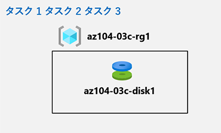

---
lab:
    title: '03c - Azure PowerShell を使用して Azure リソースを管理する'
    module: 'モジュール 03 - Azure 管理'
---

# ラボ 03c - Azure PowerShell を使用して Azure リソースを管理する
## ラボ シナリオ

このラボのタスクは以下の通りです。

+ タスク１：Azure Cloud Shell で PowerShell セッションを開始する
+ タスク２：Azure PowerShell を使用して、リソース グループと Azure マネージド ディスクを作成する
+ タスク３：Azure PowerShell を使用してマネージド ディスクの構成を変更する

## 予想時間: 20 分


## アーキテクチャ




## 手順

#### タスク１：Azure Cloud Shell で PowerShell セッションを開始する

このタスクでは、Cloud Shell で PowerShell セッションを開きます。 

1. このポータルでは、Azure portal の右上にあるアイコンをクリックして **Azure Cloud Shell** を開きます。

1. **Bash** や **PowerShell** のどちらかを選択するためのプロンプトが表示されたら、**PowerShell** を選択します。 

    >**注**: **Cloud Shell** の初回起動時に **「ストレージがマウントされていません」** というメッセージが表示された場合は、このラボで使用しているサブスクリプションを選択し、**「ストレージの作成」** を選択します。 

1. メッセージが表示されたら、**「ストレージの作成」** をクリックし、「Azure Cloud Shell」 ウィンドウが表示されるまで待ちます。 

1. 「Cloud Shell」 ウィンドウの左上隅にあるドロップダウン メニューに **PowerShell** が表示されていることを確認します。


#### **タスク 2: Azure PowerShell を使用して、リソース グループと Azure マネージド ディスクを作成する**

このタスクでは、Cloud Shell 内で Azure PowerShell セッションを使用して、リソース グループと Azure マネージド ディスクを作成します。

1. 前のラボで作成した **az104-03b-rg1** リソース グループと同じ Azure リージョンにリソース グループを作成ために、Cloud Shell 内の PowerShell セッションから次を実行します。

   ```powershell
   $location = (Get-AzResourceGroup -Name az104-03b-rg1).Location
   
   $rgName = 'az104-03c-rg1'
   
   New-AzResourceGroup -Name $rgName -Location $location
   ```
1. 新しく作成されたリソース グループのプロパティを取得するには、次のコマンドを実行します。

   ```powershell
   Get-AzResourceGroup -Name $rgName
   ```
1. 直前のラボで作成したものと同じ構成のマネージド ディスクを作成するには、次のコマンドを実行します。

   ```powershell
   $diskConfig = New-AzDiskConfig `
    -Location $location `
    -CreateOption Empty `
    -DiskSizeGB 32 `
    -Sku Standard_LRS

   $diskName = 'az104-03c-disk1'

   New-AzDisk `
    -ResourceGroupName $rgName `
    -DiskName $diskName `
    -Disk $diskConfig
   ```

1. 新しく作成されたディスクのプロパティを取得するには、次のコマンドを実行します。

   ```powershell
   Get-AzDisk -ResourceGroupName $rgName -Name $diskName
   ```


#### タスク３：Azure PowerShell を使用してマネージド ディスクの構成を変更する

このタスクでは、Cloud Shell 内で Azure PowerShell セッションを使用して、Azure マネージド ディスクの構成を管理します。 

1. Azure マネージド ディスクのサイズを **64 GB** に増やすには、Cloud Shell 内の PowerShell セッションから次のコマンドを実行します。

   ```powershell
   New-AzDiskUpdateConfig -DiskSizeGB 64 | Update-AzDisk -ResourceGroupName $rgName -DiskName $diskName
   ```

1. 変更が適用されていることを確認するには、次のコマンドを実行します。

   ```powershell
   Get-AzDisk -ResourceGroupName $rgName -Name $diskName
   ```

1. 現在の SKU が **Standard_LRS** であることを確認するには、次の手順を実行します。

   ```powershell
   (Get-AzDisk -ResourceGroupName $rgName -Name $diskName).Sku
   ```

1. ディスク パフォーマンス SKU を **Premium_LRS** に変更するには 、Cloud Shell 内の PowerShell セッションから次の手順を実行します。

   ```powershell
   New-AzDiskUpdateConfig -Sku Premium_LRS | Update-AzDisk -ResourceGroupName $rgName -DiskName $diskName
   ```

1. 変更が適用されていることを確認するには、次のコマンドを実行します。

   ```powershell
   (Get-AzDisk -ResourceGroupName $rgName -Name $diskName).Sku
   ```


#### レビュー

このラボでは次の内容を学習しました。

- タスク１：Azure Cloud Shell で PowerShell セッションを開始する
- タスク２：Azure PowerShell を使用して、リソース グループと Azure マネージド ディスクを作成する
- タスク３：Azure PowerShell を使用してマネージド ディスクの構成を変更する
