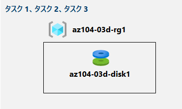

---
lab:
    title: '03d - Azure CLI を使用して Azure リソースを管理する'
    module: 'モジュール 03 -Azure 管理'
---

# ラボ 03d - Azure CLI を使用して Azure リソースを管理する
## ラボ シナリオ

このラボのタスクは以下の通りです。

+ タスク１：Azure Cloud Shell で Bash セッションを開始する
+ タスク２：Azure CLI を使用して、リソース グループと Azure マネージド ディスクを作成する
+ タスク３：Azure CLI を使用してマネージド ディスクを構成する

## 予想時間: 20 分


## アーキテクチャ




## 手順

#### タスク１：Azure Cloud Shell で Bash セッションを開始する

このタスクでは、Cloud Shell で Bash セッションを開きます。 

1. ポータルから、Azure portal の右上にあるアイコンをクリックして、**Azure Cloud Shell** を開きます。

1. **Bash** または **PowerShell** のいずれかを選択するためのプロンプトが表示されたら、**「Bash」** を選択します。 

    > **注**: **Cloud Shell** の初回起動時に「**ストレージがマウントされていません**」というメッセージが表示された場合は、このラボで使用しているサブスクリプションを選択し、**「ストレージの作成」** を選択します。 

1. メッセージが表示されたら、**「ストレージの作成」** をクリックし、「Azure Cloud Shell」 ウィンドウが表示されるまで待ちます。 

1. 「Cloud Shell」 ウィンドウの左上隅にあるドロップダウン メニューに、**「Bash」** が表示されていることを確認します。


#### タスク２：Azure CLI を使用して、リソース グループと Azure マネージド ディスクを作成する

このタスクでは、Cloud Shell 内で Azure CLI セッションを使用して、リソース グループと Azure マネージド ディスクを作成します。

1. Cloud Shell 内の Bash セッションから次のコマンドを実行します。

   ```sh
   LOCATION='eastus'
   
   RGNAME='az104-03d-rg1'
   
   az group create --name $RGNAME --location $LOCATION
   ```
1. 新しく作成されたリソース グループのプロパティを取得するには、次のコマンドを実行します。

   ```sh
   az group show --name $RGNAME
   ```
1. 前のラボで作成したものと同じ構成のマネージド ディスクを作成するには、「Cloud Shell」 内の 「Bash」 セッションから次のコードを実行します。

   ```sh
   DISKNAME='az104-03d-disk1'

   az disk create \
   --resource-group $RGNAME \
   --name $DISKNAME \
   --sku 'Standard_LRS' \
   --size-gb 32
   ```
    > **注**: 複数行の構文を使用する場合は、各行の末尾に後続スペースが入っていないバックスラッシュ (`\`) で終わり、各行の先頭に行間スペースが入らないようにしてください。

1. 新しく作成されたディスクのプロパティを取得するには、次のコマンドを実行します。

   ```sh
   az disk show --resource-group $RGNAME --name $DISKNAME
   ```


#### タスク３：Azure CLI を使用してマネージド ディスクを構成する

このタスクでは、Cloud Shell 内で Azure CLI セッションを使用して、Azure マネージド ディスクの構成を管理します。 

1. Azure マネージド ディスクのサイズを **64 GB** に増やすには 、Cloud Shell 内の Bash セッションから次のコマンドを実行します。

   ```sh
   az disk update --resource-group $RGNAME --name $DISKNAME --size-gb 64
   ```

1. 変更が適用されていることを確認するには、次のコマンドを実行します。

   ```sh
   az disk show --resource-group $RGNAME --name $DISKNAME --query diskSizeGB
   ```

1. ディスク パフォーマンス SKU を **Premium_LRS** に変更するには、Cloud Shell 内の Bash セッションから次のコマンドを実行します。

   ```sh
   az disk update --resource-group $RGNAME --name $DISKNAME --sku 'Premium_LRS'
   ```

1. 変更が適用されていることを確認するには、次のコマンドを実行します。

   ```sh
   az disk show --resource-group $RGNAME --name $DISKNAME --query sku
   ```


#### レビュー

このラボでは次の内容を学習しました。

- タスク１：Azure Cloud Shell で Bash セッションを開始する
- タスク２：Azure CLI を使用して、リソース グループと Azure マネージド ディスクを作成する
- タスク３：Azure CLI を使用してマネージド ディスクを構成する
