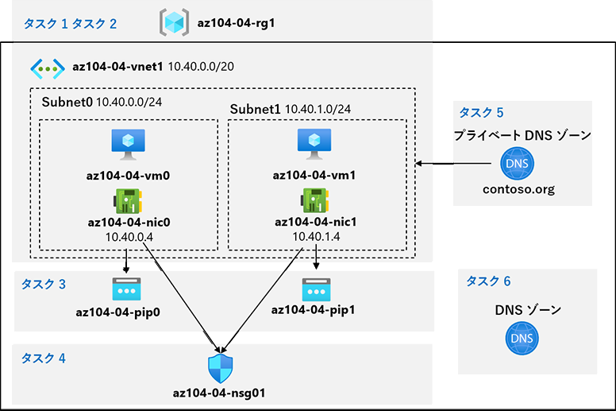

lab:
    title: '04 - 仮想ネットワークを実装する'
    module: 'モジュール 04 – バーチャル ネットワーク'

# ラボ 04 - 仮想ネットワークを実装する

# 受講生用ラボ マニュアル

## ラボ シナリオ

Azure 仮想ネットワークの機能について学習します。まず、Azure でいくつかの仮想マシンをホストする仮想ネットワークを構成します。ネットワーク ベースのセグメンテーションを実装するため、仮想マシンは仮想ネットワーク内の異なるサブネットにデプロイします。また、プライベート IP アドレスとパブリック IP アドレスが変更されないようにする必要もあります。Contoso のセキュリティ要件に準拠するには、インターネットからアクセスできる Azure 仮想マシンのパブリック エンドポイントを保護する必要があります。最後に、仮想ネットワーク内とインターネットからの両方で、DNSによる仮想マシンの名前解決を実装する必要があります。

## 目標

このラボでは次の内容を学習します。

+ タスク 1: 仮想ネットワークを作成および構成する
+ タスク 2: 仮想マシンを仮想ネットワークにデプロイする
+ タスク 3: Azure VM のプライベート IP アドレスとパブリック IP アドレスを構成する
+ タスク 4: ネットワーク セキュリティ グループを構成する
+ タスク 5: 内部の名前解決に Azure DNS を構成する
+ タスク 6: 外部の名前解決に Azure DNS を構成する

## 推定時間: 50 分

## アーキテクチャ



## 手順

### 演習 1

#### タスク 1: 仮想ネットワークを作成および構成する

このタスクでは、Azure portal を使用して、複数のサブネットを持つ仮想ネットワークを作成します。

1. [Azure Portal](https://portal.azure.com) にサインインします。

1. Azure portal で、**「仮想ネットワーク」** を検索して選択します。

    > 注:「仮想ネットワーク(クラシック)は古いバージョンです。選択しないようにしてください。

1. **「仮想ネットワーク」** ブレードで **「+ 作成」** をクリックします。

1. 仮想ネットワークを次の設定で作成します (その他の設定は既定値のままにします)。

    | 設定 | 値 |
    | --- | --- |
    | サブスクリプション | **既定のサブスクリプション** |
    | リソース グループ（新規作成） | **az104-04-rg1** |
    | 名前 | **az104-04-vnet1** |
    | 地域 | **East US** |

1. **「次 へ」** を2回クリックしてIPアドレスのタブに移動し、次の値を入力します。

    | 設定 | 値 |
    | --- | --- |
    | アドレス空間の種類 | **IPv4** |
    | 開始アドレス | **10.40.0.0** |
    | アドレス空間のサイズ | **/20 (4096個のアドレス)** |

1. **default** というサブネットがある場合は、画面右のゴミ箱のマークをクリックして削除します。

1. **「+ サブネットの追加」** をクリックして、次の値を入力してから、**「追加」** をクリックします。記載のない項目は既定値のままで進めます。

    | 設定 | 値 |
    | --- | --- |
    | サブネット名 | **subnet0** |
    | サブネットアドレス範囲 | **10.40.0.0/24** |

1.  **「確認 および 作成」** をクリックします。その後、 **「作成」** をクリックします。

    >**注:** 仮想ネットワークは約1～2分で作成されます。

1. **「リソースに移動」** をクリックします

1. **「az104-04-vnet1**」ブレードで、画面左側のツリーにある**「サブネット」** をクリックします。

1. **「az104-04-vnet1 | サブネット」**ブレードで、**「+ サブネット」** をクリックします。

1. サブネットを次の設定で作成します (その他の設定は既定値のままにします)。

      | 設定 | 値 |
      | --- | --- |
      | 名前 | **subnet1** |
      | サブネットアドレス範囲 | **10.40.1.0/24** |

1. サブネットの設定が完了したら、「**保存**」をクリックします

1. 　**「az104-04-vnet1 | サブネット」**　ブレードで、作成したサブネットが一覧上に表示されたことを確認します。

    ​     

#### タスク 2: 仮想マシンを仮想ネットワークにデプロイする

このタスクでは、ARM テンプレートを使用して、Azure 仮想マシンを仮想ネットワークの異なるサブネットにデプロイします。

1. Azure portal の右上にあるアイコンをクリックし、 **「Azure Cloud Shell」** を開きます。

1. **Bash** や **PowerShell** のどちらかを選択するためのプロンプトが表示されたら、**PowerShell** を選択します。

    > **注**: **Cloud Shell** の初回起動時に **「ストレージがマウントされていません」** というメッセージが表示された場合は、**「ストレージの作成」** を選択します。約1～2分ほどで、ストレージアカウントが作成され、コマンド入力することが可能になります。

1. 「Cloud Shell」 ウィンドウのツールバーで、**「ファイルのアップロード/ダウンロード」** アイコンをクリックし、ドロップダウン メニューで **「アップロード」** をクリックし、以下の2ファイルをCloud Shell ホーム ディレクトリにアップロードします。

      > **注:** アップロード対象のファイルは[**こちらのリンク**](https://github.com/MicrosoftLearning/AZ-104-MicrosoftAzureAdministrator/archive/master.zip)からダウンロードできます。Zipファイルを展開（解凍）して使用します。

      **\Allfiles\Labs\04\az104-04-vms-loop-template.json**, **\Allfiles\Labs\04\az104-04-vms-loop-parameters.json**

      > **注**:アップロードされたファイルの確認は、以下のいずれかで表示することが可能です。
      >
      > ```
      > ls   (bashのコマンド)
      > dir  (DOSのコマンド)
      > Get-ChildItem　(PowerShellのコマンド)
      > ```

1. 「Cloud Shell」 ウィンドウで次のコマンドを実行して、アップロードしたテンプレートとパラメーター ファイルを使用して 2 つの仮想マシンをデプロイします。パスワードの入力を求められるため、任意のパスワードを入力します。このパスワードは後続タスクで使用します。（例：Pa55w.rd1234）

      > **注:** VMのパスワードには要件が設けられています。以下の条件を満たすように設定する必要があります。<br>   ・8 文字以上 256 文字以下<br>
      >
      > ・次の 4 種類の文字のうち 3 つが必要です。<br>
      >     英小文字<br>
      >     英大文字<br>    数値(0 から 9)<br>

      ```powershell
      $rgName = 'az104-04-rg1'
      
      New-AzResourceGroupDeployment `
         -ResourceGroupName $rgName `
         -TemplateFile $HOME/az104-04-vms-loop-template.json `
         -TemplateParameterFile $HOME/az104-04-vms-loop-parameters.json
      ```

      > **注**: デプロイが完了するまで待機します。次のタスクではここでデプロイした仮想マシンを使用します。完了まで約2 分かかります。

1. 「Cloud Shell」の右上×をクリックし、画面を閉じます。

   

#### タスク 3: Azure VM のプライベート IP アドレスとパブリック IP アドレスを構成する

このタスクでは、Azure 仮想マシンのネットワーク インターフェイスに割り当てられたパブリック IP アドレスとプライベート IP アドレスの静的割り当てを構成します。

1. Azure Portal で **「パブリックIPアドレス」** を検索して選択し、**「パブリックIPアドレス」** ブレードで **「+作成」** をクリックします。

2. 以下の設定を指定して、パブリックIPアドレスを作成します（指定のないものについては既定値のまま）。

   | 設定               | 値                           |
   | ------------------ | ---------------------------- |
   | サブスクリプション | **既定のサブスクリプション** |
   | リソースグループ   | **az104-04-rg1**             |
   | 地域               | **East US**                  |
   | 名前               | **az104-04-pip0**            |
   | 可用性ゾーン       | **No Zone**                  |

3.  ** 「確認 + 作成」 ** をクリックし、検証完了後に **「作成」** をクリックします。

4. 再度 **「パブリックIPアドレス」** のブレードに戻り、 **「作成」** をクリックして先ほどと同様に2つ目のパブリックIPアドレスを作成します。

   | 設定               | 値                           |
   | ------------------ | ---------------------------- |
   | サブスクリプション | **既定のサブスクリプション** |
   | リソースグループ   | **az104-04-rg1**             |
   | 地域               | **East US**                  |
   | 名前               | **az104-04-pip1**            |
   | 可用性ゾーン       | **No Zone**                  |

5. 2つ目のパブリックIPアドレスの作成が完了したら、Azure Portal で **「リソース グループ」** を検索して選択し、**「リソース グループ」** ブレードで **「az104-04-rg1」** をクリックします。

6. **「az104-04-rg1」** ブレードのリソースのリストで、「**az104-04-vnet1」** をクリックします。

7. 「**az104-04-vnet1**」 ブレードで、画面左側のツリーにある **「接続デバイス」**をクリックします。

8. 「az104-04-vnet1 | 接続デバイス」ブレードで、「az104-04-vnet1」ネットワークに接続されている 2 つのネットワーク インターフェイス **az104-04-nic0** と **az104-04-nic1** が一覧にあることを確認します。

9. **「az104-04-nic0」** をクリックします。

10. **「az104-04-nic0」** ブレードで画面左側のツリーにある **「IP 構成」** をクリックします。

11. 画面中央にある **「ipconfig1」** をクリックします。

12. **「ipconfig1」** ブレードの **「プライベートIP アドレス設定」** セクションで、デフォルトの設定では **「割り当て」** が **「動的」**  になっていることを確認します。IPアドレスを固定するため、 **「静的」** に設定を変更し、**「IP アドレス」** の既定値を **10.40.0.4** のままにします。

    > **注**:プライベートIPアドレスのIPアドレス値は変更しません。

    > **参考**:プライベートIPアドレスのIPアドレス値を変更した場合、仮想マシンは再起動されます。

    > **参考**:Azure VMのIPアドレスを変更する場合は、ipconfigブレードで設定します。オペレーションシステム側で設定変更をした場合、
    >
    > 　　 仮想マシンへのRDP / SSH / Bastionの接続が不可になる可能性があります。

13. **「ipconfig1」** ブレードの **「パブリック IP アドレスの設定」** セクションで、**「パブリックIPアドレスを関連付ける」** にチェックを入れ、前の手順で作成した **"az104-04-pip0"** を選択して**「保存」** をクリックします。次の手順に進む前に、必ず保存操作が完了するまで待ちます。

14. 画面右上の **「az104-04-vnet1」** をクリックし、 前の画面に戻ります。

15. **「az104-04-nic1」** をクリックします。

16. **「az104-04-nic1」** ブレードで画面左側のツリーにある **「IP 構成」** をクリックします。

17. 画面中央にある **「ipconfig1」** をクリックします。

18. **「ipconfig1」** ブレードの **「プライベートIP アドレス設定」** セクションで、デフォルトの設定では **「割り当て」**  が「**動的**」になっていることを確認します。IPアドレスを固定するため、 **「静的」** に設定を変更し、**「IP アドレス」** の既定値を **10.40.1.4** のままにします。

    > **注**:プライベートIPアドレスのIPアドレス値は変更しません。

19. **「ipconfig1」** ブレードの **「パブリック IP アドレスの設定」** セクションで、**「パブリックIPアドレスを関連付ける」** にチェックを入れ、前の手順で作成した**"az104-04-pip1"**を選択して**「保存」** をクリックします。次の手順に進む前に、必ず保存操作が完了するまで待ちます。

20. **「az104-04-rg1** リソース グループ」 ブレードに戻り、そのリソースのリストで **「az104-04-vm0」** をクリックし、**「az104-04-vm0** 仮想マシン」 ブレードでパブリック IP アドレスのエントリをメモします。

21. **「az104-04-rg1** リソース グループ」 ブレードに戻り、そのリソースのリストで **「az104-04-vm1」** をクリックし、**「az104-04-vm1** 仮想マシン」 ブレードでパブリック IP アドレスのエントリをメモします。

    > **注**: このラボの最後のタスクで、両方の IP アドレスが必要になります。

#### タスク 4: ネットワーク セキュリティ グループを構成する

このタスクでは、Azure 仮想マシンへの接続を制限できるように、ネットワーク セキュリティ グループを構成します。

1. Azure Portal で 「**az104-04-rg1** リソース グループ」 ブレードに戻り、リソースのリストから 「**az104-04-vm0**」 をクリックします。

1. 「**az104-04-vm0 概要**」 ブレードで、「**接続**」 をクリックします。「**RDP**」タブで 「**RDP ファイルのダウンロード**」 をクリックし、RDPファイルを実行してプロンプトに従ってリモート デスクトップ セッションを開始します。

1. 接続の成否を確認します。この段階では接続に失敗します。

    >**注**:失敗することは想定されています。既定では、Standard SKU のパブリック IP アドレスが割り当てられているネットワーク インターフェイスは、ネットワーク セキュリティ グループによる保護されている必要があるためです。リモート デスクトップ接続を許可するには、インターネットからの受信 RDP トラフィックを明示的に許可するネットワーク セキュリティ グループを作成し、仮想マシンのネットワーク インターフェイスに割り当てます。

1. Azure portal で 「**ネットワーク セキュリティ グループ**」 を検索して選択し、「**ネットワーク セキュリティ グループ**」 ブレードで 「**+ 作成**」 をクリックします。

1. ネットワーク セキュリティ グループを次の設定で作成します (その他の設定は既定値のままにします)。

    | 設定 | 値 |
    | --- | --- |
    | サブスクリプション | **既定のサブスクリプション** |
    | リソース グループ | **az104-04-rg1** |
    | 名前 | **az104-04-nsg01** |
    | 地域 | **East US** |

1. 「**確認および作成**」 をクリックします。検証の成功を確認し、「**作成**」 をクリックしてデプロイを実行します。

    >**注**: デプロイが完了するのを待ちます。これにはおよそ 2 分かかります。

1. 「デプロイ」 ブレードで 「**リソースに移動**」 をクリックして、「**az104-04-nsg01**」 ブレードを開きます。

1. 「**az104-04-nsg01**」 ブレードの 画面左側のツリーにある「**受信セキュリティ規則**」 をクリックします。

1.  **「az104-04-nsg01 | 受信セキュリティ規則」** ブレードで、 **「+追加」** をクリックします。

1. 次の設定を使用して受信ルールを**追加**します (その他の設定は既定値のままにします)。

    | 設定 | 値 |
    | --- | --- |
    | ソース | **Any** |
    | ソース ポート範囲 | * |
    | 宛先 | **Any** |
    | サービス | **RDP** |
    | アクション | **許可** |
    | 優先度 | **300** |
    | 名前 | **AllowRDPInBound** |

1. **「az104-04-nsg01」** ブレードの 画面左側のツリーにある **「ネットワーク インターフェイス」**  をクリックし、**「関連付け」** をクリックします。

1. 作成したNSG「**az104-04-nsg01**」 をネットワークインターフェース「**az104-04-nic0**」 および 「**az104-04-nic1**」 に関連付けます。

      > **注**: ネットワーク セキュリティ グループのルールがネットワーク インターフェイス カードに適用されるまで、最大 5 分かかる場合があります。

1. 以前の手順でダウンロードした**「az104-04-vm0」**のRDPファイルを実行してプロンプトに従ってリモート デスクトップ セッションを開始します。

      > **注**: この手順では、Windows コンピューターからリモート デスクトップ経由で接続することを指します。Mac ではMac App Store からリモート デスクトップ クライアントを、Linux コンピューターではオープンソースの RDP クライアント ソフトウェアを使用できます。

      > **注**: ターゲット仮想マシンに接続する際は、警告メッセージを無視して進めます。

1. 資格情報の入力プロンプトが表示されたら、ユーザー名：**Student**、パスワードは**以前のタスクで設定した任意のパスワード**を使用してサインインします。

      > **注**: 接続したリモート デスクトップ セッションは閉じずに最小化します。これは次のタスクで必要になります。

      

#### タスク 5: 内部の名前解決に Azure DNS を構成する

このタスクでは、Azure プライベート DNS ゾーンを使用して、仮想ネットワーク内での DNS 名前解決を構成します。

1. Azure portal で、「**プライベート DNS ゾーン**」 を検索して選択します。

1. 「**プライベート DNS ゾーン**」 ブレードで 「**+ 作成**」 をクリックします。

1. プライベート DNS ゾーンを次の設定で作成します (その他の設定は既定値のままにします)。

    | 設定 | 値 |
    | --- | --- |
    | サブスクリプション | **既定のサブスクリプション** |
    | リソース グループ | **az104-04-rg1** |
    | 名前 | **contoso.org** |

1. 「**レビュー作成**」をクリックします。検証を実行し、「**作成**」をクリックしてデプロイを送信します。

    >**注**: プライベート DNS ゾーンが作成されるのを待ちます。これにはおよそ 2 分かかります。

1. 「**リソースに移動**」 をクリックして 「**contoso.org \| DNS プライベート ゾーン**」 ブレードを開きます。

1. **「contoso.org 」**ブレードの 画面左側のツリーにある**「仮想ネットワーク リンク」** をクリックします。

1. **「+ 追加」** をクリックして、仮想ネットワーク リンクを次の設定で作成します (他の設定は既定値のままにします)。

    | 設定 | 値 |
    | --- | --- |
    | リンク名 | **az104-04-vnet1-link** |
    | サブスクリプション | **既定のサブスクリプション** |
    | 仮想ネットワーク | **az104-04-vnet1** |
    | 自動登録を有効にする | **有効(チェックボックスにチェックを入れる)** |

1. **「OK」** をクリックします。

    >**注:** 仮想ネットワーク リンクが作成されるまで待ちます。通常は 1 分もかかりません。

1. **「contoso.org** プライベート DNS ゾーン」ブレードのサイドバーで、**「概要」** をクリックします。

1. **az104-04-vm0** および **az104-04-vm1** の DNS レコードが、レコード セットのリストに**自動登録**として表示されることを確認 します。

    >**注:** レコード セットが表示されない場合は、数分待ってからページを更新する必要があります。

1. リモート デスクトップ セッションを **az104-04-vm0** に切り替えて、「**スタート**」 ボタンを右クリックし、右クリック メニューで、「**Windows PowerShell (Admin)**」 をクリックします。

1. Windows PowerShell コンソール ウィンドウで次のコマンドを実行して、新しく作成したプライベート DNS ゾーン内の内部名前解決をテストします。

    ```powershell
    nslookup az104-04-vm0.contoso.org
    nslookup az104-04-vm1.contoso.org
    ```

1. コマンドの出力に、**az104-04-vm1** (**10.40.1.4**) のプライベート IP アドレスが含まれていることを確認します。

#### タスク 6: 外部の名前解決に Azure DNS を構成する

このタスクでは、Azure パブリック DNS ゾーンを使用して外部 DNS 名前解決を構成します。

1. **SEA-DEV** ラボ システムの Web ブラウザーで新しいタブを開き、[**GoDaddy**](https://www.godaddy.com/domains/domain-name-search) に移動します。

2. ドメイン名検索を使用して、使用されていないドメイン名を識別します。

   > 注：「購入する」のボタンがありますが、実際には検索ボタンとなります。ドメインを実際に購入する必要はありません。
   >
   
3. Azure portal で **「DNS ゾーン」** を検索して選択し、**「DNS ゾーン」** ブレードで **「+ 作成」** をクリックします。

4. DNS ゾーンを次の設定で作成します (その他の設定は既定値のままにします)。

   | 設定               | 値                                                |
   | ------------------ | ------------------------------------------------- |
   | サブスクリプション | **既定のサブスクリプション**                      |
   | リソース グループ  | **az104-04-rg1**                                  |
   | 名前               | **手順2で確認した使用していないドメイン名を入力** |

5. 「**レビュー作成**」 をクリックします。検証を実行し、「**作成**」 をクリックしてデプロイを実行します。

   > **注**: DNS ゾーンが作成されるのを待ちます。これにはおよそ 2 分かかります。

6. 「**リソースに移動**」 をクリックして、新しく作成した DNS ゾーンのブレードを開きます。

7. 「**DNS ゾーン**」 ブレードで、「**+ レコード セット**」 をクリックします。

8. レコード セットを次の設定で追加します (その他の設定は既定値のままにします)。

   | 設定        | 値                                       |
   | ----------- | ---------------------------------------- |
   | 名前        | **az104-04-vm0**                         |
   | 種類        | **A - IPv4へのアドレスレコード**         |
   | TTL         | **1**                                    |
   | TTL の単位  | **時間**                                 |
   | IP アドレス | **az104-04-vm0のパブリック IP アドレス** |
   
9. 「**OK**」 をクリックします

10. 「DNS ゾーン」 ブレードで、「**+ レコード セット**」 をクリックします。

11. レコード セットを次の設定で追加します (その他の設定は既定値のままにします)。

    | 設定        | 値                                        |
    | ----------- | ----------------------------------------- |
    | 名前        | **az104-04-vm1**                          |
    | 種類        | **A**                                     |
    | TTL         | **1**                                     |
    | TTL の単位  | **時間**                                  |
    | IP アドレス | **az104-04-vm1** のパブリック IP アドレス |
    
12. 「**OK**」 をクリックします

13. 「DNS ゾーン」 ブレードで、「**ネーム サーバー 1**」 のエントリの名前をメモします。

14. Azure portal で、右上にあるアイコンをクリックして、**「Cloud Shell」** の **「PowerShell」** セッションを開きます。

15. 「Cloud Shell」ペインで次のコマンドを実行して、新しく作成した DNS ゾーンに設定されている **「az104-04-vm0」** DNS レコード セットの名前解決をテストします (プレースホルダー `[Name server 1]` をこのタスクで前にメモした **ネーム サーバー 1** の名前に、プレースホルダー `[domain name]` をこのタスクで前に作成した DNS ドメイン名に置き換えます)。

    ```powershell
    nslookup az104-04-vm0.[domain name] [Name server 1]
    ```

16. コマンドの出力に、**az104-04-vm0** のパブリック IP アドレスが含まれていることを確認します。

17. 「Cloud Shell」ペインで次のコマンドを実行して、 新しく作成した DNS ゾーンに設定されている「**az104-04-vm1**」 DNS レコード セットの名前解決をテストします (プレースホルダー `[Name server 1]` をこのタスクで前にメモした **ネーム サーバー 1** の名前に、プレースホルダー `[domain name]` をこのタスクで前に作成した DNS ドメインに置き換えます)。

    ```powershell
    nslookup az104-04-vm1.[domain name] [Name server 1]
    ```

18. コマンドの出力に、**az104-04-vm1** のパブリック IP アドレスが含まれていることを確認します。

#### 確認

このラボでは次の内容を学習しました。

+ 仮想ネットワークを作成して構成しました
+ 仮想マシンを仮想ネットワークにデプロイしました
+ Azure VM のプライベート IP アドレスとパブリック IP アドレスを構成しました
+ ネットワーク セキュリティ グループを構成しました
+ Azure DNS を内部の名前解決用に構成しました
+ Azure DNS を外部の名前解決用に構成しました
