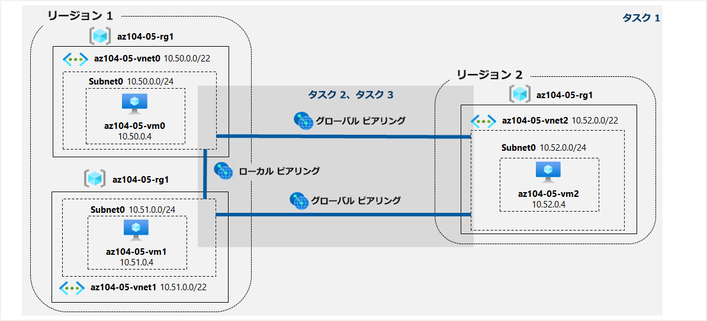

---
lab:
    title: '05 - サイト間接続を実装する'
    module: 'モジュール 05 - サイト間接続'
---

# ラボ 05 - サイト間の接続性 を実装する
# 学生用ラボ マニュアル

## ラボ シナリオ

Contoso では、ボストン、ニューヨーク、シアトルの各オフィスを、メッシュ ワイドエリア ネットワーク リンクを介して接続しており、各オフィスの間に完全な接続性を備えています。Contoso のオンプレミス ネットワークのトポロジを反映したラボ環境を実装して、その機能を検証します。

## 目標

このラボでは次の内容を学習します。

+ タスク 1: ラボ環境をプロビジョニングする
+ タスク 2: ローカルおよびグローバルバーチャル ネットワーク ピアリングを構成する
+ タスク 3: サイト間接続をテストする

## 予想時間: 30 分

## アーキテクチャ



### 指示

#### タスク 1: ラボ環境をプロビジョニングする

このタスクでは、3 つの仮想マシンをそれぞれ別のバーチャル ネットワークにデプロイし、そのうちの 2 つを同じ Azure リージョンに配置し、3 つ目の仮想マシンを別の Azure リージョンにデプロイします。

1. [Azure portal](https://portal.azure.com/) にサインインします。

1. **「リソースグループ」** を検索して選択し、**「az104-05-rg1」**から始まるリソースグループの名称をメモします。後続のタスクでこのリソースグループ名を使用します。

1. Azure portal の右上にあるアイコンをクリックして **Azure Cloud Shell** を開きます。

1. **Bash** や **PowerShell** のどちらかを選択するためのプロンプトが表示されたら、**PowerShell** を選択します。

    > **注**: **Cloud Shell** の初回起動時に **「ストレージがマウントされていません」** というメッセージが表示された場合は、このラボで使用しているサブスクリプションを選択し、**「詳細設定を表示」**をクリックします。**「リソースグループ」**については既存のものを使用し、**「ストレージアカウント」**、**「共有ファイル」**については新規作成を選択して任意のユニークな文字列(英小文字および数字)を入力します。入力完了後、**「ストレージの作成」** を選択します。

1. Cloud Shell ウィンドウのツールバーで、**「ファイルのアップロード/ダウンロード」** アイコンをクリックし、ドロップダウン メニューで 

    **「アップロード」** をクリックして、以下のファイルをファイルをCloud Shell ホーム ディレクトリにアップロードします。

    　　 **\Allfiles\Labs\05\az104-05-vnetvm-loop-template.json** 

    　　 **\Allfiles\Labs\05\az104-05-vnetvm-loop-parameters.json**

1. 「Cloud Shell」 ウィンドウで、次のコマンドを実行してアップロードしたテンプレートとパラメーター ファイルを使用して 仮想ネットワークおよび仮想マシンをデプロイします。**ResourceGroupName** で指定するリソースグループ名は、以前にメモしたリソースグループ名に書き換えます。パスワードの入力を求められるため、任意のパスワードを入力します。（例：Pa55w.rd1234）

   >  **注:** VMのパスワードには要件が設けられています。以下の条件を満たすように設定する必要があります。<br>
   > ・8 文字以上 256 文字以下<br>
   > ・次の 4 種類の文字のうち 3 つが必要です。<br>
   > 	英小文字<br>
   > 	英大文字<br>
   > 	数値(0 から 9)<br>
   > 	記号<br>

       ```
        New-AzResourceGroupDeployment `
           -ResourceGroupName '[resourceGroupName]' `
           -TemplateFile $HOME/az104-05-vnetvm-loop-template.json `
           -TemplateParameterFile $HOME/az104-05-vnetvm-loop-parameters.json `
           -location1 "EastUS" `
           -location2 "WestUS"
       ```

    > **注**: デプロイが完了するまで待ってから次の手順に進んでください。これにはおよそ 2 分かかります。

1. 「Cloud Shell」 ウィンドウを閉じます。


#### タスク 2: ローカルおよびグローバルバーチャル ネットワーク ピアリングを構成する

このタスクでは、前のタスクでデプロイしたバーチャル ネットワーク間で、ローカル ピアリングとグローバル ピアリングを構成します。

1. Azure portal で、 **「vnet」** と検索して「仮想ネットワーク」を選択します。

1. 前のタスクで作成したバーチャル ネットワークを確認し、最初の 2 つが同じ Azure リージョンに配置され、3 番目が別の Azure リージョンに存在することを確認します。

    >**注**: デプロイされた3つのバーチャルネットワークは、それぞれのIP アドレス範囲が重複しないようにテンプレートが設計されています。

1. バーチャル ネットワークのリストで、**「az104-05-vnet0」** をクリックします。

1. 「**az104-05-vnet0** バーチャル ネットワーク」 ブレードの **「設定」** セクションで **「ピアリング」** をクリックしてから、**「+ 追加」** をクリックします。

1. 次の設定でピアリングを追加し (指定のない項目は既定値のままにする)、**「追加」** をクリックします。

   | 設定 | 値|
   | --- | --- |
   | **この仮想ネットワーク**：ピアリング リンク名 | **az104-05-vnet0_to_az104-05-vnet1** |
   | **この仮想ネットワーク**：リモート仮想ネットワークへのトラフィック | **許可（規定）** |
   | **この仮想ネットワーク**：リモート仮想ネットワークから転送されたトラフィック | **この仮想ネットワークの外部から来ているトラフィックをブロックする** |
   | **この仮想ネットワーク**：仮想ネットワーク ゲートウェイまたはルート サーバー | **なし** |
   | **リモート仮想ネットワーク**：ピアリング リンク名 | **az104-05-vnet1_to_az104-05-vnet0** |
   | **リモート仮想ネットワーク**：仮想ネットワークのデプロイ モデル | **Resource Manager** |
   | **リモート仮想ネットワーク**：リソース ID を知っている | 未選択 |
   | サブスクリプション | **既定のサブスクリプション** |
   | 仮想ネットワーク | **az104-05-vnet1** |
   | リモート仮想ネットワークへのトラフィック | **許可（規定）** |
   | リモート仮想ネットワークから転送されたトラフィック | **この仮想ネットワークの外部から来ているトラフィックをブロックする** |
   | 仮想ネットワーク ゲートウェイまたはルート サーバー | **なし** |

   >**注**: この手順では、az104-05-vnet0 から az104-05-vnet1、az104-05-vnet1 から az104-05-vnet0 までの 2 つのローカル ピアリングを確立します。

   >**注**: 前のタスクで作成したバーチャル ネットワークが表示されない Azure Portal インターフェイスで問題が発生した場合は、Cloud Shell から次のPowerShell コマンドを実行して、ピアリングを構成できます。コマンドで実行する場合、**$rgName**で指定するリソースグループ名を以前のタスクでメモしたリソースグループ名に書き換える必要があります。

   ```powershell
   $rgName = '[resourceGroupName]'
   
   $vnet0 = Get-AzVirtualNetwork -Name 'az104-05-vnet0' -ResourceGroupName $rgname
   
   $vnet1 = Get-AzVirtualNetwork -Name 'az104-05-vnet1' -ResourceGroupName $rgname
   
   Add-AzVirtualNetworkPeering -Name 'az104-05-vnet0_to_az104-05-vnet1' -VirtualNetwork $vnet0 -RemoteVirtualNetworkId $vnet1.Id
   
   Add-AzVirtualNetworkPeering -Name 'az104-05-vnet1_to_az104-05-vnet0' -VirtualNetwork $vnet1 -RemoteVirtualNetworkId $vnet0.Id
   ```

1. 「**az104-05-vnet0** バーチャル ネットワーク」 ブレードの **「設定」** セクションで **「ピアリング」** をクリックしてから、**「+ 追加」** をクリックします。

1. 次の設定でピアリングを追加し (指定のない項目は既定値のままにする)、**「追加」** をクリックします。

   | 設定 | 値|
   | --- | --- |
   | **この仮想ネットワーク**：ピアリング リンク名                | **az104-05-vnet0_to_az104-05-vnet2**                         |
   | **この仮想ネットワーク**：リモート仮想ネットワークへのトラフィック | **許可（規定）**                                             |
   | **この仮想ネットワーク**：リモート仮想ネットワークから転送されたトラフィック | **この仮想ネットワークの外部から来ているトラフィックをブロックする** |
   | **この仮想ネットワーク**：仮想ネットワーク ゲートウェイまたはルート サーバー | **なし**                                                     |
   | **リモート仮想ネットワーク**：ピアリング リンク名            | **az104-05-vnet2_to_az104-05-vnet0**                         |
   | **リモート仮想ネットワーク**：仮想ネットワークのデプロイ モデル | **Resource Manager**                                         |
   | **リモート仮想ネットワーク**：リソース ID を知っている       | 未選択                                                       |
   | サブスクリプション                                           | **既定のサブスクリプション**                 |
   | 仮想ネットワーク                                             | **az104-05-vnet2**                                           |
   | リモート仮想ネットワークへのトラフィック                     | **許可（規定）**                                             |
   | リモート仮想ネットワークから転送されたトラフィック           | **この仮想ネットワークの外部から来ているトラフィックをブロックする** |
   | 仮想ネットワーク ゲートウェイまたはルート サーバー           | **なし**                                                     |

   >**注**: このステップでは、az104-05-vnet0 から az104-05-vnet2、az104-05-vnet2 から az104-05-vnet0 までの 2 つのグローバル ピアリングを確立します。

   >**注**: 前のタスクで作成したバーチャル ネットワークが表示されない Azure Portal インターフェイスで問題が発生した場合は、Cloud Shell から次のPowerShell コマンドを実行して、ピアリングを構成できます。コマンドで実行する場合、**$rgName**で指定するリソースグループ名を以前のタスクでメモしたリソースグループ名に書き換える必要があります。

   ```powershell
   $rgName = '[resourceGroupName]'
   
   $vnet0 = Get-AzVirtualNetwork -Name 'az104-05-vnet0' -ResourceGroupName $rgname
   
   $vnet2 = Get-AzVirtualNetwork -Name 'az104-05-vnet2' -ResourceGroupName $rgname
   
   Add-AzVirtualNetworkPeering -Name 'az104-05-vnet0_to_az104-05-vnet2' -VirtualNetwork $vnet0 -RemoteVirtualNetworkId $vnet2.Id
   
   Add-AzVirtualNetworkPeering -Name 'az104-05-vnet2_to_az104-05-vnet0' -VirtualNetwork $vnet2 -RemoteVirtualNetworkId $vnet0.Id
   ```

1. **「バーチャル ネットワーク」** ブレードに戻り、バーチャル ネットワークの一覧で **「az104-05-vnet1」** をクリックします。

1. 「**az104-05-vnet1** バーチャル ネットワーク」 ブレードの **「設定」** セクションで **「ピアリング」** をクリックしてから、**「+ 追加」** をクリックします。

1. 次の設定でピアリングを追加し (指定のない項目は既定値のままにする)、**「追加」** をクリックします。

   | 設定 | 値|
   | --- | --- |
   | **この仮想ネットワーク**：ピアリング リンク名                | **az104-05-vnet1_to_az104-05-vnet2**                         |
   | **この仮想ネットワーク**：リモート仮想ネットワークへのトラフィック | **許可（規定）**                                             |
   | **この仮想ネットワーク**：リモート仮想ネットワークから転送されたトラフィック | **この仮想ネットワークの外部から来ているトラフィックをブロックする** |
   | **この仮想ネットワーク**：仮想ネットワーク ゲートウェイまたはルート サーバー | **なし**                                                     |
   | **リモート仮想ネットワーク**：ピアリング リンク名            | **az104-05-vnet2_to_az104-05-vnet1**                         |
   | **リモート仮想ネットワーク**：仮想ネットワークのデプロイ モデル | **Resource Manager**                                         |
   | **リモート仮想ネットワーク**：リソース ID を知っている       | 未選択                                                       |
   | サブスクリプション                                           | **既定のサブスクリプション**                 |
   | 仮想ネットワーク                                             | **az104-05-vnet2**                                           |
   | リモート仮想ネットワークへのトラフィック                     | **許可（規定）**                                             |
   | リモート仮想ネットワークから転送されたトラフィック           | **この仮想ネットワークの外部から来ているトラフィックをブロックする** |
   | 仮想ネットワーク ゲートウェイまたはルート サーバー           | **なし**                                                     |

   > **注**: このステップでは、az104-05-vnet1 から az104-05-vnet2、az104-05-vnet2 から az104-05-vnet1 までの 2 つのグローバル ピアリングを確立します。

   >**注**: 前のタスクで作成したバーチャル ネットワークが表示されない Azure Portal インターフェイスで問題が発生した場合は、Cloud Shell から次のPowerShell コマンドを実行して、ピアリングを構成できます。コマンドで実行する場合、**$rgName**で指定するリソースグループ名を以前のタスクでメモしたリソースグループ名に書き換える必要があります。

   ```powershell
   $rgName = '[resourceGroupName]'
   
   $vnet1 = Get-AzVirtualNetwork -Name 'az104-05-vnet1' -ResourceGroupName $rgname
   
   $vnet2 = Get-AzVirtualNetwork -Name 'az104-05-vnet2' -ResourceGroupName $rgname
   
   Add-AzVirtualNetworkPeering -Name 'az104-05-vnet1_to_az104-05-vnet2' -VirtualNetwork $vnet1 -RemoteVirtualNetworkId $vnet2.Id
   
   Add-AzVirtualNetworkPeering -Name 'az104-05-vnet2_to_az104-05-vnet1' -VirtualNetwork $vnet2 -RemoteVirtualNetworkId $vnet1.Id
   ```

#### タスク 3: サイト間接続をテストする

このタスクでは、前のタスクでローカル ピアリングとグローバル ピアリングを介して接続した 3 つのバーチャル ネットワーク上の仮想マシン間の接続性をテストします。

1. Azure portal で、**「Virtual Machines」** を検索して選択します。

1. 仮想マシンのリストで、**「az104-05-vm0」** をクリックします。

1. **「az104-05-vm0」** ブレードで、**「接続」** をクリックし、ドロップダウン メニューで **「RDP」** をクリックし、**「RDP で接続する」** ブレードで **「RDP ファイルのダウンロード」** をクリックし、ダウンロードしたRDPファイルを実行してプロンプトに従ってリモート デスクトップ セッションを開始します。

    >**注**: この手順では、Windows コンピューターからリモート デスクトップ経由で接続することを指します。Mac ではMac App Store からリモート デスクトップ クライアントを使用でき、Linux コンピューターではオープンソースの RDP クライアント ソフトウェアを使用できます。

    >**注**: ターゲット仮想マシンに接続する際は、警告メッセージを無視して進めます。

1. 資格情報を入力するプロンプトが表示されたら、ユーザー名：**Student**、以前のタスクで任意に設定したパスワードを使用してサインインします。

1. **az104-05-vm0** へのリモート デスクトップ セッション内で、**「スタート」** ボタンを右クリックし、右クリック メニューで **「Windows PowerShell (Admin)」** をクリックします。

1. Windows PowerShell コンソール ウィンドウで、次のコマンドを実行して、TCP ポート 3389 での **「az104-05-vm1」** (プライベート IP アドレスが **10.51.0.4** ) への接続性をテストします。

   ```powershell
   Test-NetConnection -ComputerName 10.51.0.4 -Port 3389 -InformationLevel 'Detailed'
   ```

    >**注**: このテストで TCP 3389 を使用するのは、このポートがオペレーティング システムのファイアウォールによって既定で許可されているためです。

1. コマンドの出力を確認し、接続が正常に行われたことを確認します。

1. Windows PowerShell コンソール ウィンドウで次のコマンドを実行して、**「az104-05-vm2」** (プライベート IP アドレスが **10.52.0.4**) への接続性をテストします。

   ```powershell
   Test-NetConnection -ComputerName 10.52.0.4 -Port 3389 -InformationLevel 'Detailed'
   ```

1. Azure portal に戻り、**「Virtual Machines」** ブレードに戻ります。

1. 仮想マシンのリストで、**「az104-05-vm1」** をクリックします。

1. **「az104-05-vm1」** ブレードで、**「接続」** をクリックし、ドロップダウン メニューで **「RDP」** をクリックし、**「RDP で接続する」** ブレードで **「RDP ファイルのダウンロード」** をクリックし、ダウンロードしたRDPファイルを実行してプロンプトに従ってリモート デスクトップ セッションを開始します。

1. 資格情報を入力するプロンプトが表示されたら、ユーザー名：**Student**と以前のタスクで任意に設定したパスワードを使用してサインインします。

1. **az104-05-vm1** へのリモート デスクトップ セッション内で、**「スタート」** ボタンを右クリックし、右クリック メニューで **「Windows PowerShell (Admin)」** をクリックします。

1. Windows PowerShell コンソール ウィンドウで、次のコマンドを実行して、TCP ポート 3389 での **「az104-05-vm2」** (プライベート IP アドレスが **10.52.0.4** ) への接続性をテストします。

   ```powershell
   Test-NetConnection -ComputerName 10.52.0.4 -Port 3389 -InformationLevel 'Detailed'
   ```

    >**注**: このテストで TCP 3389 を使用するのは、このポートがオペレーティング システムのファイアウォールによって既定で許可されているためです。

1. コマンドの出力を確認し、接続が正常に行われたことを確認します。

#### レビュー

このラボでは次の内容を学習しました。

+ ラボ環境をプロビジョニングしました
+ ローカルバーチャル ネットワーク ピアリングおよびグローバルバーチャル ネットワーク ピアリングを構成しました
+ サイト間の接続性をテストしました
