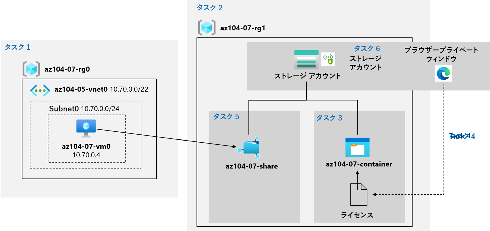

---
lab:
    title: '07 - Azure Storage の管理'
    module: 'モジュール 07 - Azure Storage'
---

# ラボ 07 - Azure Storage の管理
# 受講生用ラボ マニュアル

## ラボ シナリオ

現在オンプレミスのデータ ストアに存在するファイルを格納するために、Azure Storage の使用を検討しています。ファイルの大部分は頻繁にアクセスされませんが、いくつか例外となるものも存在しています。アクセス頻度の低いファイルを低価格のストレージ層に配置することで、ストレージのコストを最小限に抑えるよう検討する必要があります。ネットワーク アクセス、認証、認可、レプリケーションなど、Azure Storage で提供されるさまざまな保護メカニズムについても活用する予定です。また、Azure Filesがオンプレミスとのファイル共有をホストするのに適しているかについても検討する必要があります。

## 目標

このラボでは次の内容を学習します。

+ タスク 1: ラボ環境をプロビジョニングする
+ タスク 2: Azure Storage アカウントを作成し、構成する
+ タスク 3: Blob Storage を管理する
+ タスク 4: Azure Storage の認証と許可を管理する
+ タスク 5: Azure Files 共有を作成し、構成する
+ タスク 6: Azure Storage のネットワーク アクセスを管理する

## 予想時間: 40 分

## アーキテクチャ


## 手順

### 演習 1

#### タスク 1: ラボ環境をプロビジョニングする

このタスクでは、この課題の後半で使用する 仮想マシンをデプロイします。

1. [Azure Portal](https://portal.azure.com) にサインインします。

1. **「リソースグループ」** を検索して選択し、**「az104-07」**から始まる2つのリソースグループの名称をメモします。後続のタスクでそれぞれのリソースグループ名を使用します。

1. Azure Portal の右上にあるアイコンをクリックして **Azure Cloud Shell** を開きます。

1. **Bash** や **PowerShell** のどちらかを選択するためのプロンプトが表示されたら、**PowerShell** を選択します。

    >**注**: **Cloud Shell** の初回起動時に **「ストレージがマウントされていません」** というメッセージが表示された場合は、このラボで使用しているサブスクリプションを選択し、**「詳細設定を表示」** をクリックします。 **「リソースグループ」** については既存のものを使用し、 **「ストレージアカウント」** 、 **「共有ファイル」** については新規作成を選択して任意の文字列を入力します。入力完了後、 **「ストレージの作成」** を選択します。

1. Cloud Shell ウィンドウのツールバーで、**「ファイルのアップロード/ダウンロード」** アイコンをクリックし、ドロップダウン メニューで **「アップロード」** をクリックして、以下のファイルをファイルをCloud Shell ホーム ディレクトリにアップロードします。

    　　 **\\Allfiles\\Labs\\07\\az104-07-vm-template.json** 

    　　 **\\Allfiles\\Labs\\07\\az104-07-vm-parameters.json**

1. 「Cloud Shell」 ウィンドウから次のコマンドを実行し、アップロードされたテンプレートとパラメーター ファイルを使用して、仮想マシンをデプロイします。**「$rgName」**で指定するリソースグループ名は、以前にメモしたリソースグループ名の内**「az104-07-rg0」**から始まるものに書き換えます。パスワードの入力を求められるため、任意のパスワードを入力します。（例：Pa55w.rd1234）

   > **注:** VMのパスワードには要件が設けられています。以下の条件を満たすように設定する必要があります。<br>
   > ・8 文字以上 256 文字以下<br>
   > ・次の 4 種類の文字のうち 3 つが必要です。<br>
   > 	英小文字<br>
   > 	英大文字<br>
   > 	数値(0 から 9)<br>
   > 	記号<br>

   ```powershell
   $rgName = '[resourceGroupName]'
   
   New-AzResourceGroupDeployment `
      -ResourceGroupName $rgName `
      -TemplateFile $HOME/az104-07-vm-template.json `
      -TemplateParameterFile $HOME/az104-07-vm-parameters.json `
      -AsJob
   ```

    >**注**: デプロイが完了するのを待たずに、次のタスクに進みます。

1. 「Cloud Shell」 ペインを閉じます。

#### タスク 2: Azure Storage アカウントを作成し、構成する

このタスクでは、Azure Storage アカウントを作成して構成します。

1. Azure portal で、**「ストレージ アカウント」** を検索して選択し、**「+ 作成」** をクリックします。

1. 「**ストレージ アカウントの作成**」 ブレードの 「**基本**」 タブで 、次の設定を指定します (他の設定は既定値のままにします)。

    | 設定 | 値 |
    | --- | --- |
    | サブスクリプション | **既定のサブスクリプション**                                 |
    | リソース グループ | **「az104-07-rg1」**から始まるリソースグループ名を選択 |
    | ストレージ アカウント名 | 文字と数字で構成される、長さ 3 文字から 24 文字までのグローバルに一意な名前(例えば、 ctc####等) |
    | 地域 | **(US) East US** |
    | パフォーマンス | **Standard** |
    | 冗長性 | **geo 冗長ストレージ (GRS)** |

1. **「ストレージ アカウントの作成」** ブレードの **「基本」** タブで **「次へ: 詳細設定 >」** をクリックし、利用可能なオプションを確認し、既定値を受け入れ、 **「次へ: ネットワーク >」** をクリックします。

1. **「ストレージ アカウントの作成」** ブレードの **「ネットワーク」** タブで、利用可能なオプションを確認し、既定のオプション **「すべてのネットワークからのパブリックアクセスを有効にする」** を受け入れ、 **「次へ: データ保護 >」** をクリックします。

1. **「ストレージ アカウントの作成」** ブレードの **「データ保護」** タブで、利用可能なオプションを確認し、既定値を受け入れて、 **「レビュー」** をクリックし、検証プロセスが完了するのを待ってから、**「作成」** をクリックします。

    >**注**: ストレージ アカウントが作成されるのを待ちます。これにはおよそ 2 分かかります。

1. 「デプロイ」 ブレードで、**「リソースに移動」** をクリックして、「Azure ストレージ アカウント」 ブレードを表示します。

1. 「ストレージ アカウント」ブレードの **「データ管理」** セクションで、**「冗長性」** をクリックし、リージョンペアの対向がセカンダリの場所となっていることを確認します。 

1. 「ストレージ アカウント|冗長性」ブレードの **「冗長性」** ドロップダウン リストから **「ローカル冗長ストレージ (LRS)」** を選択して、**「保存」** をクリックし、変更を保存します。
    ストレージ アカウントの場所がプライマリのみになっていることを確認してください。

1. ストレージ アカウントの **「構成」** ブレードに移動し、**「BLOBのアクセスレベル (既定)」** を **「クール」** に設定して、変更を保存します。

    >**注**: クール アクセス層は、頻繁にアクセスされないデータに適しています。

#### タスク 3: Blob Storage を管理する

このタスクでは、BLOB コンテナーを作成し、そのコンテナーに BLOB をアップロードします。

1. 「ストレージ アカウント」ブレードの **「データ ストレージ」** セクションで、**「コンテナー」** をクリックします。

1. **「+ コンテナー」** をクリックして、次の設定を使用してコンテナーを作成します。

    | 設定 | 値 |
    | --- | --- |
    | 名前 | **az104-07-container**  |
    | パブリック アクセス レベル | **プライベート (匿名アクセスはありません)** |

1. コンテナーのリストで **「az104-07-container」** をクリックし、**「アップロード」** をクリックします。

1.  **\\Allfiles\\Labs\\07\\LICENSE** を参照し、**「開く」** をクリックします。

1. **「BLOB の アップロード」** ブレードで、**「詳細設定」** セクションを展開し、次の設定を指定します 

    (その他の設定は既定値のままにします)。

    | 設定 | 値 |
    | --- | --- |
    | BLOB の種類 | **ブロック BLOB** |
    | ブロック サイズ | **4 MB** |
    | アクセス層 | **ホット** |
    | アップロード先のフォルダー | **license** |
    
    > **注**: アクセス階層は、個々の BLOB に対して設定できます。
    
1. **「アップロード」** をクリックします。

    > **注**: アップロードによって、**license** という名前のサブフォルダーが自動的に作成されます。

1. **「az104-07-container」** ブレードに戻って **「license」**サブフォルダー をクリックし、アップロードした**「LICENSE」** ファイルをクリックします。

1. **「license/LICENSE」** ブレードで、使用可能なオプションを確認します。

    > **注**: BLOB をダウンロードし、アクセス層を変更し (現在、 **ホット** に設定されています)、リースを取得するオプションがあります。これにより、リース ステータスが**ロック** (現在は **ロック解除** に設定されています) に変更され、BLOB が変更または削除されないように保護され、カスタム メタデータが割り当てられます (任意のキーと値のペアを指定することにより)。また、ファイルを最初にダウンロードすることなく、Azure portal インターフェイス内で直接ファイルを**編集**することもできます。スナップショットを作成したり、SAS トークンを生成することもできます (このオプションは次のタスクで確認します)。

#### タスク 4: Azure Storage の認証と許可を管理する

このタスクでは、Azure Storage の認証と認可を構成します。

1. **「license/LICENSE」** ブレードの **「概要」** タブで、**「URL」** エントリの横にある **「クリップボードにコピー」** ボタンをクリックします。

1. InPrivate モードを使用して別のブラウザー ウィンドウを開いて、前の手順でコピーした URL に移動します。

1. **ResourceNotFound** または **PublicAccessNotPermitted** という XML 形式のメッセージが表示されます。

    > **注**: これは正常な動作であり、作成したコンテナーのパブリック アクセス レベルが 「**プライベート (匿名アクセスはありません)**」 に設定されているためです。

1. InPrivate モードのブラウザー ウィンドウを閉じて、Azure Storage コンテナーの **「license/LICENSE」** ブレードが表示されているブラウザー ウィンドウ に戻り、**「SAS の生成」** タブに切り替えます。

1. **「license/LICENSE」** ブレードの **「SAS の生成」** タブで、次の設定を指定します (他の設定は既定値のままにします)。

    | 設定 | 値 |
    | --- | --- |
    | 署名キー | **キー 1** |
    | アクセス許可 | **読み取り** |
    | 開始（年月日） | 昨日の日付 |
    | 開始（時刻） | 現在の時刻 |
    | 有効期限（年月日） | 明日の日付 |
    | 有効期限（時刻） | 現在の時刻 |
    | 使用できる IP アドレス | 空白のままにする |

1. **「SAS トークンおよび URL を生成」** をクリックします。

1. **「BLOB SAS URL」** エントリの横にある **「クリップボードにコピー」** ボタンをクリックします。

1. InPrivate モードを使用して別のブラウザー ウィンドウを開いて、前の手順でコピーした URL に移動します。

    > **注**: Microsoft Edge を使用している場合は、**MIT ライセンス (MIT)** ページが表示されます。Chrome、Microsoft Edge (Chromium) または Firefox を使用している場合は、ファイルをダウンロードしてメモ帳で開くと、ファイルの内容を表示できるはずです。

    > **注**: 新しく生成された SAS トークンに基づいてアクセスが承認されるため、これは正常な動作です。

    > **注**: BLOB SAS URL を保存します。これは、このラボで後ほど必要になります。

#### タスク 5: Azure Files 共有を作成し、構成する

このタスクでは、Azure Files 共有を作成して構成します。

> **注**: このタスクを開始する前に、このラボの最初のタスクでプロビジョニングした仮想マシンが実行されていることを確認します。

1. Azure portal で、このラボの最初のタスクで作成したストレージ アカウントのブレードに戻り、**「データ ストレージ」** セクションの **「ファイル共有」** をクリックします。

1. **「+ ファイル共有」** をクリックし、ファイル共有を作成するため次の通り設定します。

    (その他の設定は既定値のままにします)

    | 設定 | 値 |
    | --- | --- |
    | 名前 | **az104-07-share** |

1. **「次へ:バックアップ」** ボタンがある場合はクリックし、 **「バックアップの有効化」** のチェックボックスを **「オフ」** にします、ボタンがない場合は無視して次の手順に進みます。

1. **「確認および作成」** および **「作成」** ボタンをクリックしファイル共有を作成します。

1. 新しく作成したファイル共有をクリックし、**「接続」** をクリックします。

1. 「接続」ブレードで、「Windows」タブが選択されていることを確認します。**「スクリプトの表示」** ボタンをクリックします。スクリプトを含む灰色のテキスト ボックスを確認し、そのボックスの右下隅にあるページ アイコンをクリックして、クリップボードにコピーします。

1. Azure portal で **「仮想マシン」** を検索して選択し、仮想マシンのリストで **「az104-07-vm0」** をクリックします。

1. **「az104-07-vm0」** ブレードで **「接続」** をクリックして、**「RDP」**タブからRDP接続を実施します。

1. RDP接続した仮想マシンでPowerShellコンソールを起動し、このタスクの前半でコピーしたスクリプトをPowerShellコンソールに貼り付け、**「実行」** します。

1. スクリプトが正常に完了したことを確認します。

1. 引き続きPowerShellコンソールを使用して、次のスクリプトを実行します。

    ```powershell
    New-Item -Type Directory -Path 'Z:\az104-07-folder'
    
    New-Item -Type File -Path 'Z:\az104-07-folder\az-104-07-file.txt'
    ```

1. スクリプトが正常に完了したことを確認します。

1. RDP接続を最小化し、**「az104-07-share** ファイル共有」 ブレードに戻り、左のメニューから**「参照」** を探してクリックし、フォルダーのリストに **「az104-07-folder」** があることを確認します。

1. **「az104-07-folder」** をクリックし、ファイルのリストに **「az104-07-file.txt」** があることを確認します。

#### タスク 6: Azure Storage のネットワーク アクセスを管理する

このタスクでは、Azure Storage のネットワーク アクセスを構成します。

1. Azure portal で、作成したストレージ アカウントのブレードに戻り、**「セキュリティとネットワーク」**セクションで、**「ネットワーク」** をクリックしてから、**「ファイアウォールと仮想ネットワーク」** をクリックします。

1. **「選択したネットワークとIPアドレスから有効」** のオプションを選択して、このオプションを有効にした場合に可能となる設定項目を確認します。

    > **注**: 仮想ネットワークを選択した場合、仮想ネットワークの指定サブネット上の Azure 仮想マシンとストレージ アカウントとの直接接続をサービス エンドポイントを使用して構成できます。

1. **「クライアント IP アドレス（''使用している端末のIPアドレス''）の追加」** チェック ボックスをクリックし、画面上の方にある **「保存」** を クリックして変更を保存します。

1. InPrivate モードを使用して別のブラウザー ウィンドウを開き、前のタスクで生成した BLOB SAS URL に移動します。

1. **「MIT ライセンス (MIT)」** ページの内容が表示されます。

    > **注**: これは正常な動作であり、クライアント IP アドレスから接続しているためです。

1. InPrivate モードのブラウザー ウィンドウを閉じ、Azure Storage コンテナーの**license/LICENSE** ブレードが表示されているブラウザー ウィンドウに戻ります。

1. Azure portal の右上にあるアイコンをクリックして **Azure Cloud Shell** を開きます。

1. **Bash** や **PowerShell** のどちらかを選択するためのプロンプトが表示されたら、**PowerShell** を選択します。

1. Cloud Shell ウィンドウから以下のコマンドを実行して、LICENSEファイルのダウンロードを試みます (`「blob SAS URL」` プレースホルダーを前のタスクで生成した BLOB SAS URL に置き換えます)。

   ```powershell
   Invoke-WebRequest -URI '[blob SAS URL]'
   ```
1. ダウンロードの試行が失敗したことを確認します。

    > **注**: **Authorization Failure** を示すメッセージが表示されます。**この要求には、この操作を実行する権限がありません**。Cloud Shell インスタンスをホストする Azure VM に割り当てられた IP アドレスから接続しているため、接続が拒否されます。

1. 「Cloud Shell」 ペインを閉じます。

#### レビュー

このラボでは次の内容を学習しました。

- ラボ環境をプロビジョニングしました
- Azure Storage アカウントを作成して構成しました
- BLOB ストレージを管理しました
- Azure Storage の認証と認可を管理しました
- Azure Files 共有を作成および構成しました
- Azure Storage のネットワーク アクセスを管理しました
