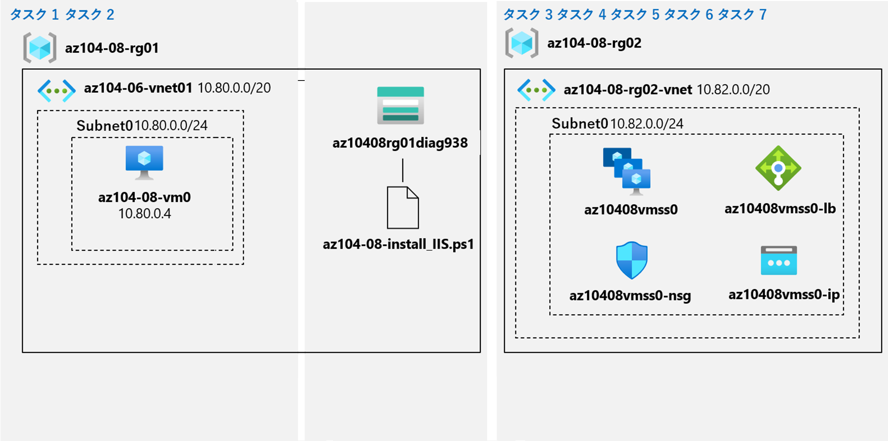

---
lab:
    title: 'ラボ 08 - 仮想マシンの管理'
    module: 'モジュール 08 - 仮想マシン'
---

# ラボ 08 - 仮想マシンの管理
# 受講生用ラボ マニュアル

## ラボ シナリオ

Azure上に仮想マシンをデプロイおよび構成する際、使用できるオプションを検討しています。まず、仮想マシンを使用する場合に実装できるコンピューティングとストレージの復元性とスケーラビリティのオプションを検討する必要があります。次に、仮想マシン スケール セットを使用する場合に利用可能なコンピューティングとストレージの復元性とスケーラビリティ オプションを確認する必要があります。また、仮想マシンのカスタム スクリプト拡張機能を使用して、仮想マシンと仮想マシン スケール セットを自動的に構成する機能についても説明します。

## 目標

このラボでは次の内容を学習します。

+ タスク 1: Azure Portalを使用してAzure 仮想マシンをデプロイする
+ タスク 2: 仮想マシンの拡張機能をテストする
+ タスク 3: Azure Virtual Machines のコンピューティングとストレージをスケーリングする
+ タスク 4: Microsoft.Insights および Microsoft.AlertsManagement リソース プロバイダーを登録する
+ タスク 5: Azure Portal を使用してゾーン冗長されたAzure 仮想マシン スケール セットをデプロイする
+ タスク 6: 仮想マシン拡張機能を使用して、Azure 仮想マシン スケール セットを構成する

## 予想時間: 50 分

## アーキテクチャの図




## 手順

### 演習 1

#### タスク 1: Azure Portalを使用してAzure 仮想マシンをデプロイする

このタスクでは、Azure Portalを使用してAzure 仮想マシンをデプロイします。また、デプロイ時に拡張機能を使用してWindows Server Web サーバー ロールをインストールします

1. Skillableでアカウント情報を取得し、[Azure Portal](http://portal.azure.com)にサインインします。

1. Azure Portal で、**「Virtual Machines」** を検索して選択し、**「+ 作成」**のドロップダウンリストより**「Azure 仮想マシン」** をクリックします。

1. **「仮想マシンの作成」** ブレードの **「基本」** タブで、次の設定を指定します (他の設定は既定値のままにします)。

    | 設定 | 値 |
    | --- | --- |
    | サブスクリプション | **既定のサブスクリプション** |
    | リソース グループ（新規作成） | **az104-08-rg01** |
    | 仮想マシン名 | **az104-08-vm0** |
    | 地域 | **(US) East US** |
    | 可用性オプション | **インフラストラクチャ冗長は必要ありません** |
    | イメージ | **Windows Server 2022 Datacenter: Azure Edition - x64 Gen2** |
    | サイズ | **Standard D2s v3** |
    | ユーザー名 | **Student** |
    | パスワード | **Pa55w.rd1234** |
    | パブリック受信ポート | **選択したポートを許可する(HTTP(80),RDP(3389))** |

1. **「次: ディスク>」** をクリックし、「**仮想マシンの作成」** ブレードの **「ディスク」** タブで、次の設定を指定します (他の設定は既定値のままにします)。

    | 設定 | 値 |
    | --- | --- |
    | OS ディスクの種類 | **Premium SSD** |

1. **「次: ネットワーク >」** をクリックし、**「仮想ネットワーク」** テキストボックスの下にある **「新規作成」** をクリックします。

1. **「仮想ネットワークの作成」** ブレードで、次の設定を指定します (他の設定は既定値のままにします)。

    | 設定 | 値 |
    | --- | --- |
    | 名前 | **az104-08-rg01-vnet** |
    | （アドレス空間）アドレス範囲 | **10.80.0.0/20** |
    | サブネット名 | **subnet0** |
    | （サブネット）アドレス範囲 | **10.80.0.0/24** |

1. **「OK」** をクリックし、**「仮想マシンの作成」** ブレードの **「ネットワーク」** タブに戻り、次の設定を指定します (他の設定は既定値のままにします)。

    | 設定 | 値 |
    | --- | --- |
    | サブネット | **subnet0** |
    | NIC ネットワーク セキュリティ グループ | **basic** |
    | 高速ネットワーク | **オフ（チェックを外す）** |
    
1. **「次: 管理 >」** で、**「仮想マシンの作成」** ブレードの **「管理」** タブで、次の設定を指定します (他は既定値のままにします)。

    | 設定 | 値 |
    | --- | --- |
    | パッチ オーケストレーション オプション | **手動で更新** |

1. **「次: 監視 >」** で、**「仮想マシンの作成」** ブレードの **「Monitoring」** タブでは設定変更をせずに内容のみを確認し、**「次: 詳細>」** をクリックします。

1. **「仮想マシンの作成」** ブレードの **「詳細」** タブで、**「インストールする拡張機能を選択します」** をクリックします。

1. **「拡張機能のインストール」** ブレードで、**「Custom script extension」** をクリックして**「次へ」** をクリックします。

1. **「Configure Custom Script Extension Extension」** ブレードで、**「参照」** をクリックします。

1. **「ストレージ アカウント」** ブレードで、**「＋ストレージ アカウント」** をクリックします。

1. **「ストレージ アカウントの作成」** ブレードで次の設定を指定し、**「OK」**をクリックします。

      | 設定                | 値                              |
      | ------------------- | ------------------------------- |
      | 名前                | **az10408rg01diagXXXX**         |
      | アカウントの種類    | **StorageV2（汎用 v2）**        |
      | パフォーマンス      | **Standard**                    |
      | レプリケーション    | **ローカル冗長ストレージ(LRS)** |
      | 場所                | **(US) East US**                |
      | リソースグループ    | **az104-08-rg01**               |
      | TLSの最小バージョン | **バージョン 1.2**              |

      >  **注:** ストレージアカウントを新規に作成する際、名称が一意になる必要があります。適宜"XXXX"の部分を変更して作成してください。例：az10408rg01diag0123

1. ストレージアカウントの作成が完了すると **「ストレージ アカウント」** ブレードへ戻ります。作成したストレージアカウントをクリックします。

1. **「コンテナー」**ブレードで**「+コンテナー」** をクリックし、任意の名称でコンテナーを作成します。作成が完了したら、作成したコンテナーへ移動します。

1. **「アップロード」** をクリックし、**「BLOB のアップロード」** ブレードでフォルダー アイコンをクリックし、**「開く」** ダイアログ ボックスで **「\\Allfiles\\Labs\\08」** フォルダーに移動して、**「az104-08-install_IIS.ps1」** を選択します。**「開く」** をクリックし、**「BLOB のアップロード」** ブレードに戻り、**「アップロード」** をクリックします。

1. アップロードしたファイルを選択した状態で、**「選択」** をクリックします。

1. **「作成」**をクリックして**「仮想マシンの作成」**ブレードへ戻り、**「確認および作成」** をクリックします。

1. **「確認および作成」** ブレードで、**「作成」** をクリックします。

1. デプロイの完了を確認し、**「リソースに移動」** をクリックします。表示される **「パブリック IP アドレス」**   を確認し、メモします（次のタスクで使用します）。

#### タスク 2: 仮想マシンの拡張機能をテストする

このタスクでは、前のタスクでデプロイしたAzure 仮想マシンにインストールされた Windows Server Web サーバー ロールをテストします。

1. Azure portal で、**「ストレージ アカウント」** を検索して選択し、**「ストレージ アカウント」** ブレードで、前のタスクで作成したストレージ アカウントを表すエントリをクリックします。（リソースグループが「az104-08-rg01」となっているものが、該当のストレージアカウントです。）

1. **CloudShell**を起動します。**PowerShell**を選択し、ストレージアカウントの作成を求められるため、ガイダンスに従って作成します。

1. CloudShellが起動したら、以下のコマンドを実行して仮想マシンへのWebアクセスをテストします。**[IPAddress]**セクションは以前のタスクで確認した仮想マシンのパブリックIPアドレスに書き換えます。

   ```powershell
   Invoke-WebRequest -URI http://[IPAddress] -UseBasicParsing
   ```

    >**注**: コマンドレットの実行を完了するために Internet Explorer への依存関係を排除するには、**-UseBasicParsing** パラメーターが必要です。

    >**注**: ブラウザを使用してアドレス欄にhttp://[IPAddress]を入力することで、**az104-08-vm0** でホストされている Web サイトにアクセスすることもできます。

#### タスク 3: Azure Virtual Machines のコンピューティングとストレージをスケーリングする

このタスクでは、サイズを変更して Azure 仮想マシンのコンピューティングをスケーリングし、データ ディスクを接続して構成することでストレージをスケーリングします。

1. Azure portal で、**仮想マシン**を検索して選択し、**「仮想マシン」** ブレードで、**az104-08-vm0** を選択します。

1. **Az104-08-vm0** 仮想マシン ブレードで、「**設定**」セクションの **「サイズ」** をクリックし、仮想マシンのサイズを **Standard DS1_v2** に設定し、**「サイズの変更」** をクリックします。

    >**注**: **Standard DS1_v2** がない場合は、別のサイズを選択します。

1. **「az104-08-vm0** 仮想マシン」 ブレードで、同じく「**設定**」セクションの **「ディスク」** をクリックし、**「データ ディスク」** の下の、**「+ 新しいディスクを作成して接続する」** をクリックします。

1. 次の設定でマネージド ディスクを作成します (他は既定値のままにします)

    | 設定 | 値 |
    | --- | --- |
    | ディスク名 | **az104-08-vm0-datadisk-0** |
    | ストレージの種類 | **Premium SSD** |
    | サイズ (GiB) | **1024** |

1. もう一度**「データ ディスク」** の **「+ 新しいディスクを作成して接続する」** をクリックします。

1. 次の設定でマネージド ディスクを作成します (他は既定値のままにします)

    | 設定 | 値 |
    | --- | --- |
    | ディスク名 | **az104-08-vm0-datadisk-1** |
    | ストレージの種類 | **Premium SSD** |
    | サイズ (GiB)| **1024 GiB** |

1. **「保存」** をクリックします。

1. **「az104-08-vm0」** ブレードの **「操作」** セクションで、 **「実行コマンド」** をクリックし、コマンドのリストで **RunPowerShellScript** を選択します。

1. **「実行コマンド スクリプト」** ブレードで、次のように入力し、**「実行」** をクリックして、単純なレイアウトと固定プロビジョニングを備えた 2 つのディスクで構成されるドライブ Z を作成します。

   ```powershell
   New-StoragePool -FriendlyName storagepool1 -StorageSubsystemFriendlyName "Windows Storage*" -PhysicalDisks (Get-PhysicalDisk -CanPool $true)
   
   New-VirtualDisk -StoragePoolFriendlyName storagepool1 -FriendlyName virtualdisk1 -Size 2046GB -ResiliencySettingName Simple -ProvisioningType Fixed
   
   Initialize-Disk -VirtualDisk (Get-VirtualDisk -FriendlyName virtualdisk1)
   
   New-Partition -DiskNumber 4 -UseMaximumSize -DriveLetter Z
   ```

    > **注**: コマンドが正常に完了するまで待ちます。

#### タスク 4: Microsoft.Insights および Microsoft.AlertsManagement リソース プロバイダーを登録する

1. Azure portal の右上にあるアイコンをクリックして **Azure Cloud Shell** を開きます。

1. **Bash** や **PowerShell** のどちらかを選択するためのプロンプトが表示されたら、**PowerShell** を選択します。

    >**注**: **Cloud Shell** の初回起動時に **「ストレージがマウントされていません」** というメッセージが表示された場合は、このラボで使用しているサブスクリプションを選択し、**「ストレージの作成」** を選択します。

1. 「Cloud Shell」ウィンドウから、次のコマンドを実行して、Microsoft.Insights および Microsoft.AlertsManagement リソース プロバイダーを登録します。

   ```powershell
   Register-AzResourceProvider -ProviderNamespace Microsoft.Insights
   
   Register-AzResourceProvider -ProviderNamespace Microsoft.AlertsManagement
   ```

#### タスク 5: Azure portal を使用してゾーン復元可能な Azure 仮想マシン スケール セットをデプロイする

このタスクでは、Azure portal を使用して、可用性ゾーン間で Azure 仮想マシン スケール セットをデプロイします。

1. Azure portal で、**Virtual Machine Scale Sets**を検索して選択し、「**Virtual Machine Scale Sets**」 ブレードで、「**+ 追加**」を選択します。

1. **「仮想マシン スケール セットの作成」** ブレードの **「基本」** タブで、次の設定を指定します(他の設定は既定値のままにします)。設定完了後、**「次：スポット >」**をクリックしてAzureスポットで設定可能な内容を確認します（変更なし）。

    | 設定 | 値 |
    | --- | --- |
    | サブスクリプション | **既定のサブスクリプション** |
    | リソース グループ（新規作成） | **az104-08-rg02** |
    | 仮想マシン スケール セットの名前 | **az10408vmss0** |
    | 地域 | **East US** |
    | 可用性ゾーン | **Zone 1、 2、 3** |
    | イメージ | **Windows Server 2019 Datacenter - x64 Gen2** |
    | サイズ | **Standard D2s_v3** |
    | ユーザー名 | **Student** |
    | パスワード | **Pa55w.rd1234** |
    
    >**注**: Windows 仮想マシンの可用性ゾーンへのデプロイをサポートする Azure リージョンのリストについては、「[Azure のAvailability Zonesとは](https://docs.microsoft.com/ja-jp/azure/availability-zones/az-overview)」を参照してください。

1. **「次: ディスク >」** をクリックします。**「ディスク」** タブで、既定値を受け入れて 「**次: ネットワーク >」** をクリックします。

1. **「仮想マシン スケール セットの作成」** ブレードの **「ネットワーク」** タブで、 **「仮想ネットワーク」** テキスト ボックスの下にある **「仮想ネットワークの作成」** リンクをクリックし、次の設定を実施した後 **「OK」** をクリックして新しい仮想ネットワークを作成します (他は既定値のままにします)。

    | 設定 | 値 |
    | --- | --- |
    | 仮想ネットワーク（仮想ネットワークの作成） | **az104-08-rg02-vnet** |
    | （アドレス空間）アドレス範囲 | **10.82.0.0/20** |
    | サブネット名 | **subnet0** |
    | （サブネット）アドレス範囲 | **10.82.0.0/24** |

    >**注**: 新しい仮想ネットワークを作成し、**「仮想マシン スケール セットの作成」** ブレードの **「ネットワーク」** タブに戻ると、**「仮想ネットワーク」** の値が自動的に **az104-08-rg02-vnet** に設定されます。

1. **「仮想マシン スケール セットの作成」** ブレードの **「ネットワーク」** タブに戻り、ネットワーク インターフェイス エントリの右側にある **「ネットワーク インターフェイスの編集」**(鉛筆) アイコンをクリックします。

1. **「ネットワーク インターフェイスの編集」** ブレードの **「NIC ネットワーク セキュリティ グループ」** セクションで、**「詳細」** をクリックし、**「ネットワーク セキュリティグループの構成」** ドロップダウン リストの下にある **「新規作成」** リンクをクリックします。

1. **「ネットワーク セキュリティ グループの作成」** ブレードで、次の設定を指定します (他の設定は既定値のままにします)。

    | 設定 | 値 |
    | --- | --- |
    | 名前 | **az10408vmss0-nsg** |

1. **「+受信規則の追加」** リンクをクリックし、次の設定を使用して受信セキュリティ規則を追加します (他の設定は既定値のままにします)。

    | 設定 | 値 |
    | --- | --- |
    | ソース | **Any** |
    | ソースポート範囲 | * |
    | 宛先 | **Any** |
    | サービス | **Custom** |
    | 宛先ポート範囲 | **80** |
    | プロトコル | **TCP** |
    | アクション | **許可** |
    | 優先度 | **1010** |
    | 名前 | **custom-allow-http** |

1. **「追加」** をクリックし、**「ネットワーク セキュリティ グループの作成」** ブレードに戻って、**「OK」** をクリックします。

1. **「ネットワーク インターフェイスの編集」** ブレードに戻り、**「パブリック IP アドレス」** セクションで **「有効」** をクリックし、**「OK」** をクリックします。

1. **「仮想マシンスケールセットの作成」** ブレードの **「ネットワーク」** タブに戻り、**「負荷分散」** セクションで、**「Azure Load Balancer」** が選択されていることを確認し、**「ロードバランサーの作成」**をクリックします。次の設定を指定して (他の設定はデフォルト値のままにします)、**「作成」**をクリックしてロードバランサーを作成します。

    | 設定 | 値 |
    | --- | --- |
    | ロード バランサー名 | **az10408vmss0-lb** |
    | 種類 | **パブリック** |
    
1. **「次: スケーリング >」** をクリックします。 **「スケーリング」** タブで、次の設定を指定し (他の設定は既定値のままにします)、 **「次: 管理 >」** をクリックします。

    | 設定 | 値 |
    | --- | --- |
    | 初期インスタンス数 | **2** |
    | スケーリング ポリシー | **手動スケーリング** |

1. 「**仮想マシン スケール セットの作成**」 ブレードの 「**管理**」 タブで、次の設定を指定します (他の設定は既定値のままにします)。

    | 設定 | 値 |
    | --- | --- |
    | ブート診断 | **カスタム ストレージ アカウントで有効にする** |
    | 診断ストレージ アカウント | (新規)az10408rg02diagXXX |

    >**注**: 次のタスクでは、このストレージ アカウントの名前が必要になります。

   **「次 : 正常性 >」** をクリックします。

1. **「仮想マシン スケール セットの作成」** ブレードの **「正常性」** タブで、変更を加えずに既定の設定を確認し、 **「次: 詳細 >」** をクリックします。

1. **「仮想マシン スケール セットの作成」** ブレードの **「詳細」** タブで、変更を加えずに既定の設定を確認し、 **「確認および作成」** をクリックします。

1. 検証が成功したことを確認し、**「作成」** をクリックします。

    >**注**: 仮想マシン スケール セットのデプロイが完了するのを待ちます。これにはおよそ 5 分かかります。

#### タスク 6: 仮想マシン拡張機能を使用して、Azure 仮想マシン スケール セットを構成する

このタスクでは、カスタム スクリプト仮想マシン拡張機能を使用して、前のタスクでデプロイした Azure 仮想マシン スケール セットのインスタンスに Windows Server Web サーバー ロールをインストールします。

1. Azure portal で、**「ストレージ アカウント」** を検索して選択し、**「ストレージ アカウント」** ブレードで、前のタスクで作成した診断ストレージ アカウントを表すエントリをクリックします。（リソースグループが「az104-08-rg02」となっているものが、該当のストレージアカウントです。）

1. ストレージ アカウント ブレードの **「データ ストレージ」** セクションで、 **「コンテナー」** をクリックしてから、 **「+ コンテナー」** をクリックします。

1. **「新しいコンテナー」** ブレードで、次の設定を指定し (他は既定値のままにします) **「作成」** をクリックします。

    | 設定 | 値 |
    | --- | --- |
    | 名前 | script |
    | パブリック アクセス レベル | **プライベート (匿名アクセスはありません**) |

1. コンテナーのリストを表示しているストレージ アカウント ブレードに戻り、**「script」** をクリックします。

1. **「script」** ブレードで、**「アップロード」** をクリックします。

1. **「BLOB のアップロード」** ブレードでフォルダー アイコンをクリックし、**「開く」** ダイアログ ボックスで **「\\Allfiles\\Labs\\08」** フォルダーに移動して、**「az104-08-install_IIS.ps1」** を選択します。 **「開く」** をクリックし、**「BLOB のアップロード」** ブレードに戻り、**「アップロード」** をクリックします。

1. Azure portal で、**「仮想マシン スケールセット」** ブレードに戻り、**「az10408vmss0」** をクリックします。

1. **「z10408vmss0」** ブレードの **「設定」** セクションで、**「拡張機能」** をクリックし、**「+ 追加」** をクリックします。

1. **「拡張機能のインストール」** ブレードで、 **「Custom Script Extension」** 検索し、クリックして**「次へ」** をクリックします。

1. **「Configure Custom Script Extension Extension」** ブレードから、**「参照」** をクリックします。

1. **「ストレージ アカウント」** ブレードで、**az104-08-install_IIS.ps1** スクリプトをアップロードしたストレージ アカウントの名前をクリックし、**「コンテナー」** ブレードで **「script」** をクリックし、**「script」** ブレードで **「az104-08-install_IIS.ps1」** をクリックしてから、**「選択」** をクリックします。

1. **「Configure Custom Script Extension Extension」** ブレードに戻り、**「作成」** をクリックします。

     >**注**: 拡張機能のインストールが完了するのを待ってから、次の手順に進みます。

1. **「az10408vmss0」** ブレードの **「設定」** セクションで、**「インスタンス」** をクリックし、仮想マシン スケール セットの 2 つのインスタンスの横にあるチェックボックスをオンにして、**「アップグレード」** をクリックして、確認を求められたら、**「はい」** をクリックします。

    >**注**: アップグレードが完了するのを待ってから、次の手順に進みます。

1. Azure portal で **「ロード バランサー」** を検索して選択し、ロード バランサーのリストで **「az10408vmss0-lb」** をクリックします。

1. **「az10408vmss0-lb」** ブレードでの **「設定」** セクションで、 **「フロントエンドIP 構成」** をクリックし、**「IPアドレス」**の値をメモし、新しいブラウザー タブを開いて、その IP アドレスに移動します。

    >**注**: ブラウザー ページに、Azure 仮想マシン スケール セット **「az10408vmss0」** のいずれかのインスタンスの名前が表示されることを確認します。

#### タスク 7: Azure 仮想マシン スケール セットのコンピューティングとストレージをスケーリングする

このタスクでは、仮想マシン スケール セット インスタンスのサイズを変更し、それらの自動スケーリング設定を構成して、ディスクを接続します。

1. Azure portal で、**Virtual Machine Scale Sets** を検索して選択し、**「az10408vmss0」** スケール セットを選択します。

1. 「**az10408vmss0**」 ブレードの 「**設定**」 セクションで、「**サイズ**」 をクリックします。

1. 使用可能なサイズのリストで、**「DS1_v2」** を選択し、**「サイズの変更」** をクリックします。

1. **「設定」** セクションで、**「インスタンス」** をクリックし、仮想マシン スケール セットの 2 つのインスタンスの横にあるチェックボックスをオンにします。**「アップグレード」** をクリックし、確認を求められたら、**「はい」** をクリックします。

1. インスタンスのリストで、最初のインスタンスを表すエントリをクリックし、スケール セット インスタンス ブレードで、その**場所** (Azure 仮想マシン スケール セットをデプロイしたターゲット Azure リージョン内のゾーンの 1 つである必要があります) をメモします。

1. **「az10408vmss0 - インスタンス」**ブレードに戻り、2 番目のインスタンスを表すエントリをクリックし、スケール セット インスタンス ブレードで、その**場所** (Azure 仮想マシン スケール セットをデプロイしたターゲット Azure リージョン内の他の 2 つのゾーンの 1 つである必要があります) をメモします。

1. **「az10408vmss0 - インスタンス」** ブレードに戻り、**「設定」** セクションで **「スケーリング」** をクリックします。

1. **「az10408vmss0 - スケーリング」** ブレードで、**「カスタム自動スケーリング」** オプションを選択し、次の設定で自動スケーリングを構成します (他の設定は既定値のままにします)。

    | 設定 | 値 |
    | --- |--- |
    | スケール モード | **メトリックに基づいてスケールリングする** |

1. **「規則を追加する」** リンクをクリックし、**「スケール ルール」** ブレードで次の設定を指定します (他の設定は既定値のままにします)。

    | 設定 | 値 |
    | --- |--- |
    | メトリックのソース | **現在のリソース (az10480vmss0)** |
    | 時間の集計 | **平均** |
    | メトリック名前空間 | **仮想マシン ホスト** |
    | メトリック名 | **Network In Total** |
    | 演算子(折れ線グラフの下にある項目) | **次の値より大きい** |
    | スケール操作をトリガーするメトリックのしきい値 | **10** |
    | 期間 (分) | **1** |
    | 時間グレインの統計 | **平均** |
    | 操作 | **カウントを増やす量** |
    | クールダウン (分) | **5** |
    | インスタンス数  | **1** |

    >**注**: これらの値は、待機時間を延長せずにできるだけ早く自動スケールをトリガーすることを目的としているため、現実的な構成ではありません。

1. **「追加」** をクリックし、**「az10408vmss0 - スケーリング」** ブレードに戻って、**インスタンスの制限**を設定をします (他の設定は既定値のままにします)。

    | 設定 | 値 |
    | --- |--- |
    | インスタンス制限　最小 | **1** |
    | インスタンス制限　最大値 | **3** |
    | インスタンス制限　既定 | **1** |

1. 「**保存**」をクリックします。

1. Azure portal の右上にあるアイコンをクリックして **Azure Cloud Shell** を開きます。

1. **Bash** や **PowerShell** のどちらかを選択するためのプロンプトが表示されたら、**PowerShell** を選択します。

1. 「Cloud Shell」 ウィンドウから次のコマンドを実行して、Azure 仮想マシン スケール セット **az10408vmss0** の前にあるロード バランサーのパブリック IP アドレスを特定します。

   ```powershell
   $rgName = 'az104-08-rg02'

   $lbpipName = 'az10408vmss0-ip'

   $pip = (Get-AzPublicIpAddress -ResourceGroupName $rgName -Name $lbpipName).IpAddress
   ```

1. 「Cloud Shell」 ウィンドウから、Azure 仮想マシン スケール セット **az10408vmss0** のインスタンスでホストされている Web サイトに HTTP 要求を送信する開始ループと無限ループを次のように実行します。

   ```powershell
   while ($true) { Invoke-WebRequest -Uri "http://$pip" }
   ```

1. 「Cloud Shell」ウィンドウを最小化しますが、閉じるのではなく、**「az10408vmss0 - インスタンス」** ブレードに戻り、インスタンス数を監視します。

    >**注**: 数分待ってから **「更新」** をクリックする必要がある場合があります。

1. 3 番目のインスタンスがプロビジョニングされたら、そのブレードに移動して、その**場所**を確認します (このタスクで先ほど指定した最初の 2 つのゾーンとは異なる必要があります)。

1. 「Cloud Shell」ウィンドウを閉じます。

1. **「az10408vmss0」** ブレードの **「設定」** セクションで、**「ディスク」** をクリックし、**「+ 新しいディスクを作成し接続する」** をクリックして、次の設定で新しいマネージド ディスクを接続します (他の設定は既定値のままにします)。上の方にある**「保存」**ボタンをクリックします。

    | 設定 | 値 |
    | --- | --- |
    | LUN | **0** |
    | ストレージの種類 | **Standard HDD** |
    | サイズ (GiB) | **32** |

1. 変更を保存して、[**az10408vmss0**] ブレードの [**設定**] セクションで [**インスタンス**] をクリックします。もし「最新のモデル」項目が「はい」となっている場合は、前手順のディスク追加がポータルで認識されていないため、 **「最新の情報に更新」** をクリックして画面の更新を適宜実施してください。仮想マシン スケール セットのインスタンスの横にあるチェックボックスをオンにし、[**アップグレード**] をクリックして、確認を求められたら、[**はい**] を選択します。

    >**注**: 前の手順で接続されたディスクは未フォーマット ディスクです。使用する前に、パーティションを作成して、ファイルシステムを作成し、マウントする必要があります。これを実現するには、Azure 仮想マシンのカスタム スクリプト拡張機能を使用します。まず、既存のカスタム スクリプト拡張機能を削除する必要があります。

1. **「az10408vmss0」** ブレードの **「設定」** セクションで、**「拡張機能」** をクリックし、**「CustomScriptExtension」** をクリックし、**「アンインストール」** をクリックします。

    >**注**: アンインストールが完了するまで待機します。

1. Azure portal の右上にあるアイコンをクリックして **Azure Cloud Shell** を開きます。

1. **Bash** や **PowerShell** のどちらかを選択するためのプロンプトが表示されたら、**PowerShell** を選択します。

1. 「Cloud Shell」ウィンドウのツールバーで、 **「ファイルのアップロード/ダウンロード」** アイコンを選択し、ドロップダウン メニューで **「アップロード」** を選択して、ファイル **\\Allfiles\\Labs\\08\\az104-08-configure_VMSS_disks.ps1** を Cloud Shell ホーム ディレクトリにアップロードします。

1. 「Cloud Shell」ウィンドウから、次のコマンドを実行してスクリプトのコンテンツを表示します。

   ```powershell
   Set-Location -Path $HOME

   Get-Content -Path ./az104-08-configure_VMSS_disks.ps1
   ```

    >**注**: このスクリプトは、接続されたディスクを構成するカスタム スクリプト拡張機能をインストールします。

1. 「Cloud Shell」ウィンドウで、次を実行してスクリプトを実行し、Azure 仮想マシン スケール セットのディスクを構成します。

   ```powershell
   ./az104-08-configure_VMSS_disks.ps1
   ```

1. 「Cloud Shell」 ペインを閉じます。

1. 「**az10408vmss0**」 ブレードの 「**設定**」 セクションで、「**インスタンス**」 をクリックし、仮想マシン スケール セットのインスタンスの横にあるチェックボックスをオンにして、「**アップグレード**」 をクリックして、確認を求められたら、「**はい**」 をクリックします。

#### リソースをクリーン アップする

   >**注**: 新しく作成した Azure リソースのうち、使用しないリソースは必ず削除してください。使用しないリソースを削除しないと、予期しないコストが発生する場合があります。

1. Azure portal の **「Cloud Shell」** ウィンドウで **「PowerShell」** セッションを開きます。

1. 次のコマンドを実行して az104-08-configure_VMSS_disks.ps1 を削除します。

   ```powershell
   rm ~\az104-08*
   ```

1. 次のコマンドを実行して、このモジュールのラボ全体で作成したすべてのリソース グループのリストを表示します。

   ```powershell
   Get-AzResourceGroup -Name 'az104-08*'
   ```

1. 次のコマンドを実行して、このモジュールのラボ全体で作成したすべてのリソース グループのリストを削除します。

   ```powershell
   Get-AzResourceGroup -Name 'az104-08*' | Remove-AzResourceGroup -Force -AsJob
   ```

    >**注**: コマンドは非同期で実行されるので (-AsJob パラメーターによって決定されます)、別の PowerShell コマンドを同一 PowerShell セッション内ですぐに実行できますが、リソース グループが実際に削除されるまでに数分かかります。

#### レビュー

このラボでは次の内容を学習しました。

+ Azure Portalを使用してAzure 仮想マシンをデプロイしました
+ 仮想マシンの拡張機能を使用して、Azure 仮想マシンを構成しました
+ Azure 仮想マシンのコンピューティングとストレージをスケーリングしました
+ Azure portal を使用して、ゾーン冗長されたのある Azure 仮想マシン スケール セットをデプロイしました
+ 仮想マシン拡張機能を使用して、Azure 仮想マシン スケール セットを構成しました
+ Azure 仮想マシン スケール セットのコンピューティングとストレージをスケーリングしました
