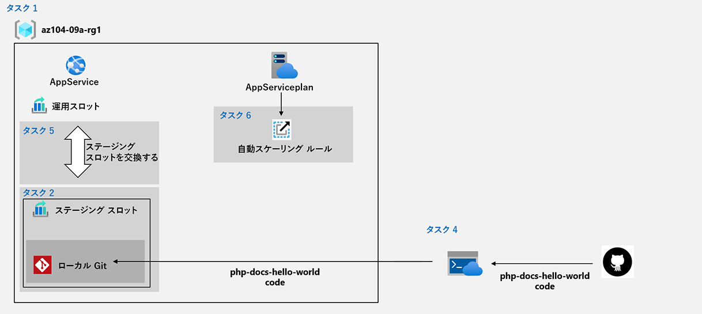

---
lab:
    title: '09a - Web Apps の実装'
    module: 'モジュール 09 - サーバーレス コンピューティング'
---

# ラボ 09a - Web Apps の実装
# 学生用ラボ マニュアル

## ラボ シナリオ

自社のオンプレミスのデータ センターでホストされている Contoso の Web サイトをホストするため、 Azure Web アプリの使用について検討する必要があります。この Web サイトは、PHP ランタイム スタックを使用して Windows サーバー上で実行されています。また、Azure Web アプリのデプロイ スロットを活用して DevOps プラクティスを実装する方法を決定する必要もあります。

## 目標

このラボでは次の内容を学習します。

+ タスク 1: Azure Web アプリを作成する
+ タスク 2: ステージング デプロイ スロットを作成する
+ タスク 3: Web アプリのデプロイ設定を構成する
+ タスク 4: ステージング デプロイ スロットにコードをデプロイする
+ タスク 5: ステージング スロットをスワップする
+ タスク 6: Azure Web アプリの自動スケールを構成およびテストする

## 予想時間: 30 分

## アーキテクチャの図



## 指示

### 演習 1

#### タスク 1: Azure Web アプリを作成する

このタスクでは、Azure Web アプリを作成します。

1. [**Azure portal**](http://portal.azure.com) にサインインします。

1. Azure portal で **「App Service」** を検索して選択し、**「App Service」** ブレードで **「+ 作成」** をクリックします。

1. **「Web アプリ」** ブレードの **「基本」** タブで、次の設定を指定します (他の設定は既定値のままにします)。

    | 設定 | 値 |
    | --- | ---|
    | サブスクリプション | **既定のサブスクリプション** |
    | リソース グループ（新規作成） | **az104-09a-rg1** |
    | 名前 | グローバルに一意な任意の名前 |
    | 公開 | **コード** |
    | ランタイム スタック | **PHP 8.0** |
    | オペレーティング システム | **Linux** |
    | 地域 | East US |
    
1. 「**確認および作成**」 をクリックします。**「Web アプリの作成」** ブレードの **「確認と作成」** タブで、検証が成功したことを確認し、**「作成」** をクリックします。

    >**注**: Web アプリの作成が完了したら、次のタスクに進みます。これにはおよそ 1 分かかります。

1. デプロイ ブレードで **「リソースに移動」** をクリックします。

#### タスク 2: ステージング デプロイ スロットを作成する

このタスクでは、ステージング デプロイ スロットを作成します。

1. 新しくデプロイした App Serviceのブレードで **「URL」** リンクをクリックし、新しいブラウザー タブに既定の Web ページが表示されることを確認します。

1. 新しいブラウザー タブを閉じ、Azure portal に戻って、「App Service」 ブレードの **「デプロイメント」** セクションで **「デプロイ スロット」** をクリックします。

    >**注**: この時点で、App Serviceには **運用** というラベルが付けられたデプロイ スロットが 1 つあります。

1. **「+ スロットの追加」** をクリックし、次の設定で新しいスロットを追加します。

    | 設定 | 値 |
    | --- | ---|
    | 名前 | **staging** |
    | 設定の複製先 | **設定を複製しない**|

1. App Serviceの **「デプロイ スロット」** ブレードに戻り、新しく作成されたステージング スロットを表すエントリをクリックします。

    >**注**: ステージング スロットのプロパティを表示するブレードが開きます。

1. ステージング スロット ブレードを確認し、URL が運用スロットに割り当てられているものと異なることを確認します。

#### タスク 3: App Serviceのデプロイ設定を構成する

このタスクでは、App Serviceのデプロイ設定を構成します。

1. ステージング デプロイ スロットのブレードの **「デプロイメント」** セクションで **「デプロイ センター」** をクリックしてから、**「設定」** タブを選択します。

    >**注:** 運用スロットではなく ステージング スロットのブレードであることを確認します。
    
1. **「設定」** タブの **「ソース」** ドロップダウン リストで、**「ローカル Git」** を選択し、**「保存」** ボタンをクリックします

1. **「デプロイ センター」** ブレードで、**「Git Clone URI」** エントリをメモ帳にコピーします。

    >**注:** この Git Clone URI の値は、ラボの次のタスクで必要です。

1. **「デプロイ センター」** ブレードで、**「ローカル Git または FTPS の資格情報」** タブを選択し、**「ユーザー スコープ」** セクションで次の設定を指定して、**「保存」** をクリックします。

    | 設定 | 値 |
    | --- | ---|
    | ユーザー名 | グローバルに一意の名前 (`@` 文字を含まないようにします) |
    | パスワード | 複雑さの要件を満たすパスワード（長さが 8 文字以上で、文字、数字、記号のうち 2 つを含む） |

    > **注:** ラボの次のタスクでは、上記のユーザー名とパスワードが必要です。

#### タスク 4: ステージング デプロイ スロットにコードをデプロイする

このタスクでは、ステージング デプロイ スロットにコードをデプロイします。

1. Azure portal の右上にあるアイコンをクリックして **Azure Cloud Shell** を開きます。

1. **Bash** や **PowerShell** のどちらかを選択するためのプロンプトが表示されたら、**PowerShell** を選択します。

    >**注**: **Cloud Shell** の初回起動時に **「ストレージがマウントされていません」** というメッセージが表示された場合は、このラボで使用しているサブスクリプションを選択し、**「ストレージの作成」** を選択します。

1. Cloud Shell ウィンドウから次のコマンドを実行して、Web アプリのコードを含むリモート リポジトリを複製します。

   ```powershell
   git clone https://github.com/Azure-Samples/php-docs-hello-world
   ```

1. Cloud Shell ウィンドウで次のコマンドを実行し、サンプル Web アプリのコードを含むローカル リポジトリから新規作成されたクローンに現在の場所を設定します。

   ```powershell
   Set-Location -Path $HOME/php-docs-hello-world/
   ```

1. Cloud Shell ウィンドウで、次のコマンドを実行してリモート git を追加します (`[deployment_user_name]`と`[git_clone_url]` のプレースホルダーを、前のタスクで指定した**デプロイ資格情報**のユーザー名と **Git クローン URL** の値に置き換えます)。

   ```powershell
   git remote add [deployment_user_name] [git_clone_url]
   ```

    >**注**: `git remote add` の後の値は**デプロイ資格情報**のユーザー名と一致する必要はありませんが、一意である必要があります。

1. Cloud Shell ウィンドウから次のコマンドを実行して、サンプル Web アプリのコードをローカル リポジトリから Azure App Serviceのステージング デプロイ スロットにプッシュします (`[deployment_user_name]` プレースホルダーを、前のタスクで指定した**デプロイ資格情報**のユーザー名の値に 置き換えます)。

   ```powershell
   git push [deployment_user_name] master
   ```

1. 認証を求められたら、`[deployment_user_name]` と、対応するパスワード (前のタスクで設定したパスワード) を入力します。

1. 「Cloud Shell」 ウィンドウを閉じます。

1. ステージング スロットのブレードで **「概要」**、**「URL」** リンクの順にクリックして、新しいブラウザー タブで既定の Web ページを表示します。

1. ブラウザー ページに **「Hello World!」** というメッセージが表示されていることを確認し、新しいタブを閉じます。

#### タスク 5: ステージング スロットをスワップする

このタスクでは、ステージング スロットを運用スロットにスワップします。

1. App Serviceの運用スロットを表示するブレードに戻ります。

1. **「デプロイ」** セクションで **「デプロイ スロット」**、**「スワップ」** の順にクリックします。

1. **「スワップ」** ブレードで、設定が既定のままであることを確認してから **「スワップ」** をクリックします。

1. **「概要」** をクリックしてから **「URL」** リンクをクリックして、新しいブラウザー タブに Web サイトのホーム ページを表示します。

1. 既定の Web ページが **「Hello World!」** というページに置き換えられていることを確認します。

#### タスク 6: Azure Web アプリの自動スケールを構成およびテストする

このタスクでは、Azure App Serviceの自動スケールの構成とテストを行います。

1. App Serviceの運用スロットを表示するブレードの **「設定」** セクションで、**「スケールアウト (App Service のプラン)」** をクリックします。

1. **「カスタム自動スケーリング」** をクリックします。

    >**注**: Web アプリを手動でスケーリングすることもできます。

1. 既定のオプションの **「メトリックに基づいてスケーリングする」** を選択したまま、**「規則を追加する」** をクリックします。

1. **「スケール ルール」** ブレードで、次の設定を指定します (他の設定は既定値のままにします)。

    | 設定 | 値 |
    | --- |--- |
    | メトリック ソース | **現在のリソース** |
    | 時間の集計 | **最大値** |
    | メトリック名前空間 | **App Service プラン 標準的なメトリック** |
    | メトリック名 | **CPU Percentage** |
    | 演算子（折れ線グラフより下の項目） | **次の値より大きい** |
    | スケール操作をトリガーするメトリックのしきい値 | **10** |
    | 期間 (分) | **1** |
    | 時間グレインの統計 | **最大値** |
    | 操作 | **カウントを増やす量** |
    | クールダウン (分) | **5** |
    | インスタンス数  | **1** |

    >**注**: これらの値は、待機時間を延長せずにできるだけ早く自動スケールをトリガーすることを目的としているため、現実的な構成ではありません。

1. **「追加」** をクリックし、「App Service プランのスケーリング」 ブレードに戻って、**インスタンスの制限** で次の値を指定します (他の設定は既定のままにします)。

    | 設定 | 値 |
    | --- |--- |
    | 最小 | **1** |
    | 最大値 | **2** |
    | 既定 | **1** |

1. **「保存」** をクリックします。

1. Azure portal の右上にあるアイコンをクリックして **Azure Cloud Shell** を開きます。

1. **Bash** や **PowerShell** のどちらかを選択するためのプロンプトが表示されたら、**PowerShell** を選択します。

1. Cloud Shell ウィンドウから次のコマンドを実行して、App Web アプリの URL を確認します。

   ```powershell
   $rgName = 'az104-09a-rg1'

   $webapp = Get-AzWebApp -ResourceGroupName $rgName
   ```

1. Cloud Shell ウィンドウで次のコマンドを実行して、HTTP 要求を Web アプリに送信する無限ループを開始します。

   ```powershell
   while ($true) { Invoke-WebRequest -Uri $webapp.DefaultHostName }
   ```

1. Cloud Shell ウィンドウを最小化し (閉じないように注意してください)、App Serviceのブレードで **「設定」** セクションで、**「スケールアウト (App Service のプラン)」** に戻ります。**「実行履歴」**のタブに移動し、インスタンス数が2に増加するまで確認します（適宜最新の状態に更新する必要があります）。

1. インスタンスID が 2 つに増えた場合は、Cloud Shell ウィンドウを再び開き、**Ctrl + C** キーを押してスクリプトを終了します。

1. 「Cloud Shell」 ウィンドウを閉じます。

#### リソースをクリーン アップする

   >**注**: 新しく作成した Azure リソースのうち、使用しないリソースは必ず削除してください。使用しないリソースを削除しないと、予期しないコストが発生する場合があります。

1. Azure portal の **「Cloud Shell」** ウィンドウで **「PowerShell」** セッションを開きます。

1. 次のコマンドを実行して、このモジュールのラボ全体で作成したすべてのリソース グループのリストを表示します。

   ```powershell
   Get-AzResourceGroup -Name 'az104-09a*'
   ```

1. 次のコマンドを実行して、このモジュールのラボ全体で作成したすべてのリソース グループのリストを削除します。

   ```powershell
   Get-AzResourceGroup -Name 'az104-09a*' | Remove-AzResourceGroup -Force -AsJob
   ```

    >**注**: コマンドは非同期で実行されるので (-AsJob パラメーターによって決定されます)、別の PowerShell コマンドを同一 PowerShell セッション内ですぐに実行できますが、リソース グループが実際に削除されるまでに数分かかります。

#### レビュー

このラボでは次の内容を学習しました。

+ Azure Web アプリを作成しました
+ ステージング デプロイ スロットを作成しました
+ Web アプリのデプロイ設定を構成しました
+ ステージング デプロイ スロットにコードをデプロイしました
+ ステージング スロットをスワップしました
+ Azure Web アプリの自動スケールを構成およびテストしました
