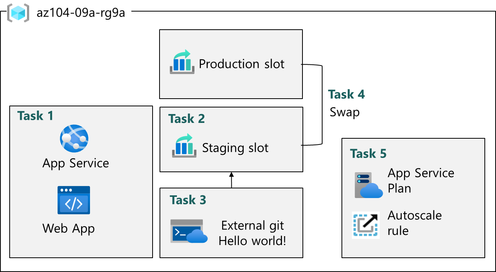

---
lab:
  title: 'ラボ 09a: Web Apps を実装する'
  module: Administer PaaS Compute Options
---

# ラボ 09a - Web Apps を実装する

## ラボ概要

このラボでは、Azure Web アプリについて学習します。 外部 GitHub リポジトリに Hello World アプリケーションを表示するように Web アプリを構成する方法について学習します。 ステージング スロットを作成し、運用スロットとスワップする方法について学習します。 また、需要の変化に対応するための自動スケーリングについても学習します。

## 推定時間:20 分

## ラボのシナリオ

あなたの組織は、自社の Web サイトをホストするための Azure Web アプリに関心を持っています。 この Web サイトは、現在、オンプレミスのデータ センターでホストされています。 この Web サイトは、PHP ランタイム スタックを使用して Windows サーバー上で実行されています。 ハードウェアは寿命に近づいており、間もなく交換が必要になります。 組織は、Web サイトのホストに Azure を使用して、新しいハードウェア コストを回避したいと考えています。 

## アーキテクチャ図

## 実施するタスク

+ タスク 1:Azure Web アプリを作成して構成する。
+ タスク 2:デプロイ スロットを作成して構成する。
+ タスク 3: Web アプリのデプロイ設定を構成する。
+ タスク 4:デプロイ スロットのスワップ。
+ タスク 5:Azure Web アプリの自動スケールを構成およびテストします。

## タスク 1:Azure Web アプリを作成して構成する

このタスクでは、Azure Web アプリを作成します。 Azure App Service は、Web、モバイル、その他の Web ベースのアプリケーション用のサービスとしてのプラットフォーム (PAAS) ソリューションです。 Azure Web アプリは、PHP、Java、.NET などのほとんどのランタイム環境をホストする Azure App Service の一部です。 選択した App Service プランによって、Web アプリのコンピューティング、ストレージ、機能が決まります。 

1. [**Azure portal**](https://portal.azure.com) にサインインします。

1. `App services` を検索して選択します。

1. **[+ 作成]** を選び、ドロップダウン メニューから **[Web アプリ]** を選びます。 

1. **[Web アプリの作成]** ブレードの **[基本]** タブで、次の設定を指定します (他の設定は既定値のままにします)。

    | 設定 | 値 |
    | --- | ---|
    | サブスクリプション | 既定のサブスクリプション |
    | リソースグループ | `az104-rg9` から始まるリソースグループ |
    | 名前 | WebAppXXXXXXXX（Xの部分にはアカウント名に含まれる数字8桁と同じ値を入力してください） |
    | 安全な一意の既定のホスト名がオンになっています | オフ |
    | 公開 | **コード** |
    | ランタイム スタック | **PHP 8.2** |
    | オペレーティング システム | **Linux** |
    | 地域 | **East US** |
    | 価格プラン | **Premium v3 P1V3** ([価格プランを確認する]をクリックして一覧から選択) |
    | ゾーン冗長 | 既定値を受け入れる |

 1. **[確認および作成]** をクリックし、**[作成]** をクリックします。

    >**注**:Web アプリの作成が完了してから、次のタスクに進みます。 これにはおよそ 1 分かかります。

1. デプロイ後、**[リソースに移動]** を選択します。

## タスク 2:デプロイ スロットを作成して構成する

このタスクでは、ステージング デプロイ スロットを作成します。 デプロイ スロットを使用すると、アプリを一般 (またはエンド ユーザー) に公開する前にテストを実行できます。 テストを実行したら、スロットを開発またはステージングから運用環境にスワップできます。 多くの組織が、スロットを使用して運用前テストを実行しています。 さらに、多くの組織が、アプリケーションごとに複数のスロット (開発、QA、テスト、運用など) を実行しています。

1. 新しくデプロイした Web アプリのブレードで **[既定のドメイン]** リンクをクリックし、新しいブラウザー タブに既定の Web ページを表示します。

1. 新しいブラウザー タブを閉じ、Azure portal に戻って、[Web アプリ] ブレードの **[デプロイ]** セクションで **[デプロイ スロット]** をクリックします。

1. **「+追加」** をクリックし、次の設定で新しいスロットを追加します。

    | 設定 | 値 |
    | --- | ---|
    | 名前(Name) | `staging` |
    | 次から設定を複製(Clone settings from) | **設定を複製しない(Do not clone settings)** |

1. **[追加]** を選択します。

1. Web アプリの **[デプロイ スロット]** ブレードに戻り、新しく作成されたステージング スロットを表すエントリをクリックします。

    >**注**:ステージング スロットのプロパティを表示するブレードが開きます。

1. ステージング スロット ブレードを確認し、URL が運用スロットに割り当てられているものと異なることを確認します。

## タスク 3:Web アプリのデプロイ設定を構成する

このタスクでは、Web アプリのデプロイ設定を構成します。 デプロイ設定を使用すると、継続的デプロイが可能になります。 これにより、アプリ サービスにアプリケーションの最新バージョンが確実に適用されます。

1. ステージング スロットで、**[デプロイ センター]**、**[設定]** の順に選びます。

    >**注:**  運用スロットではなく、ステージング スロットのブレードであることを確認します。
    
1. **[ソース]** ドロップダウン リストで、**[外部 Git]** を選びます。 その他の選択肢に注目してください。 

1. [リポジトリ] フィールドに「`https://github.com/Azure-Samples/php-docs-hello-world`」と入力します

1. [ブランチ] フィールドに「`master`」と入力します。

1. **[保存]** を選択します。

1. ステージング スロットから、**[概要]** を選びます。

1. **[既定のドメイン]** リンクを選び、新しいタブでその URL を開きます。 

1. **Hello World** が表示されていることを確認します。

>**注:**  デプロイには少し時間がかかる場合があります。 必ずアプリケーション ページを**更新**してください。

## タスク 4:デプロイ スロットのスワップ

このタスクでは、ステージング スロットを運用スロットにスワップします。 スロットをスワップすると、ステージング スロットでテストしたコードを使用して、運用環境に移行できます。 Azure portal では、そのスロット用にカスタマイズした他のアプリケーション設定を移動する必要があるかどうかを確認するメッセージも表示されます。 スロットのスワップは、アプリケーション チームとアプリケーション サポート チーム、特にアプリの定期的な更新プログラムとバグ修正を展開するチームにとって一般的なタスクです。

1. **[デプロイ スロット]** ブレードに戻り、**[スワップ(swap)]** を選びます。

1. 既定の設定を確認し、**[スワップの開始(start swap)]** をクリックします。

1. Web アプリの **[概要]** ブレードで、**[既定のドメイン]** リンクを選び、Web サイトのホーム ページを表示します。

1. 運用 Web ページに **Hello World** が 表示されていることを確認します。 のページを参照してください。

    >**注:**  既定のドメイン **URL** をコピーします。これは次のタスクのロード テストで必要になります。 

## タスク 5:Azure Web アプリの自動スケーリングを構成およびテストする

このタスクでは、Azure Web アプリの自動スケーリングを構成します。 自動スケーリングを使用すると、Web アプリへのトラフィックが増加した場合でも、Web アプリの最適なパフォーマンスを維持できます。 アプリをスケーリングするタイミングを判断するために、CPU 使用率、メモリ、帯域幅などのメトリックを監視できます。

1. **[App Serviceプラン]** セクションで **[スケールアウト]** を選びます。

    >**注:**  ステージング スロットではなく運用スロットで作業していることを確認してください。  

1. **[スケーリング(Scaling)]** セクションで、**[自動(Automatic)]** を選びます。

1. **[最大バースト(Maximum burst)]** フィールドで、**[2]** を選びます。

1. **[保存(Save)]** を選択します。

1. **[問題の診断と解決]** (左側のペイン) を選びます。

1. **[Load Test your App]** ボックスで、**[Create Load Test]** をクリックします。

    + **[+ 作成]** を選び、ロード テストに**名前**を付けます。  名前は一意である必要があります。
    + **[確認および作成]** 、 **[作成]** の順に選択します。

1. ロード テストの作成が完了したら、**[リソースに移動]** を選びます。

1. **[概要]** | **[HTTP 要求を追加して作成する]** で、**[作成]** を選びます。

1. **[テスト URL]** に、実際の**既定のドメイン** URL を貼り付けます。 正しく書式設定され、**https://** で始まっていることを確認します。

1. **[確認および作成]**、**[作成]** の順に選択します。

    >**注:**  テストの作成には数分かかる場合があります。 

1. **仮想ユーザー**、**応答時間**、**要求/秒**などのテスト結果を確認します。

1. **[停止]** を選択してテストの実行を完了します。

## 要点

以上でラボは完了です。 このラボの要点は次のとおりです。 

+ Azure App Service を使用すると、Web アプリの構築、デプロイ、スケーリングをすばやく行える。
+ App Service には、ASP.NET、Java、PHP、Python など、多くの開発者環境のサポートが含まれている。
+ デプロイ スロットを使用すると、Web アプリをデプロイしてテストするための個別の環境を作成できる。
+ 追加の需要に対応するために、Web アプリを手動または自動でスケーリングできる。
+ さまざまな診断とテストのツールを利用できる。 

## 自習トレーニングでさらに学習する

+ [App Service のデプロイ スロットを使ってテストとロールバック用に Web アプリのデプロイをステージングする](https://learn.microsoft.com/training/modules/stage-deploy-app-service-deployment-slots/)。 Azure App Service でデプロイ スロットを使い、デプロイの効率化と Web アプリのロールバックを行います。
+ [App Service のスケール アップとスケール アウトにより、効率的に需要に対応するために App Service Web アプリをスケーリングする](https://learn.microsoft.com/training/modules/app-service-scale-up-scale-out/)。使用可能なリソースを段階的に追加することで、アクティビティの増加期間に対応し、その後アクティビティが減少したら、コストを削減するためにこれらのリソースを減らします。
